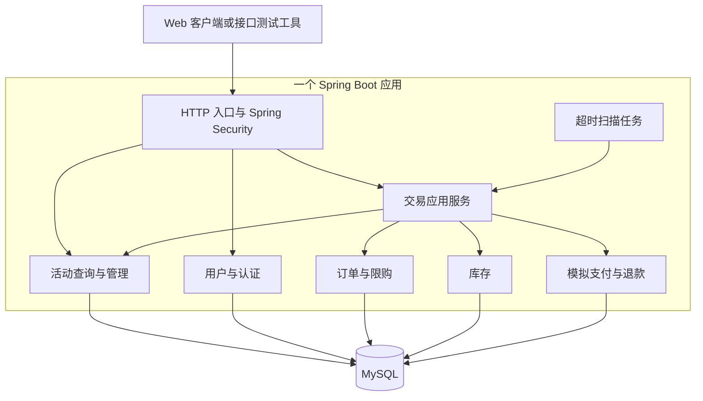
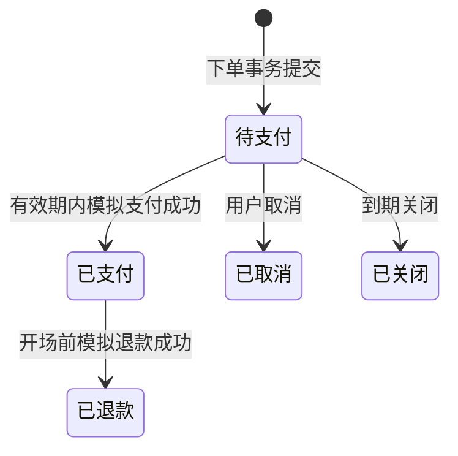

# TicketFlow 总体设计

| 文档信息 | 内容 |
| --- | --- |
| 项目名称 | TicketFlow —— 高并发智能票务平台 |
| 文档状态 | 已基线 |
| 当前版本 | v1.2 |
| 创建日期 | 2026-09-28 |
| 最近更新 | 2026-09-29 |
| 适用阶段 | 阶段 2：总体设计 |
| 上游文档 | [01_需求分析.md](01_需求分析.md)，v1.0 |

## 1. 设计目标与边界

本阶段确定系统组成、模块职责、数据归属、事务边界、关键流程、技术路线与部署方式，为详细设计提供可执行的约束。

核心决策：V1 采用 Java 模块化单体，核心数据存储于同一 MySQL 实例的同一业务数据库；创建订单、占用库存和登记限购资格在一个本地事务中提交。模拟支付、取消、超时关闭和模拟退款也分别在各自的本地事务中完成相关数据变更。

V2 在测试证明存在瓶颈后逐项增加 Redis 和消息队列。V3 通过独立 Agent 服务调用已有 Java API。本文的“已基线”表示当前采用的设计方案，不表示代码已经实现或通过性能验证。

### 1.1 业务约束

沿用需求基线：每单一个票档、一张票；同一用户每场次最多一个有效订单；支付期限为下单后 15 分钟与场次开始时间中的较早者；开场前可全额模拟退款；以已支付订单作为凭证。

首次开售后冻结价格、容量、场次时间及退款规则。活动下架停止新下单，但已有订单可在规则允许的范围内支付、取消和退款。任何性能优化都必须保持这些行为。

### 1.2 本阶段不展开的内容

数据库字段、完整 DDL、索引定义、HTTP 路径、请求响应字段、详细类设计、完整 SQL 和测试脚本由阶段 03、04 完成。V2 的跨组件协议须先完成详细设计和故障验证，再启用。

## 2. 总体架构

### 2.1 V1 运行视图



模块是同一进程中的代码边界，通过 Java 方法调用协作。用户注册、活动管理和交易流程共享一个数据源，但各模块仅通过自己的持久化层写入其拥有的数据。

### 2.2 架构选择依据

模块化单体便于理解完整调用链，也允许交易相关数据使用本地事务。代价是应用整体部署、统一扩容，热点数据库记录仍可能限制吞吐。当前团队规模与学习目标适合先采用该方案。

Controller 处理协议和参数，应用服务编排业务用例，业务模块维护规则，持久化层处理数据库访问。通用返回、异常映射和日志属于基础设施，不承担库存扣减等业务规则。

## 3. 模块划分与数据归属

| 模块 | 职责与持有数据 | 对外能力 | 约束 |
| --- | --- | --- | --- |
| identity | 用户账号、密码哈希、角色 | 注册、认证、当前用户查询 | 不接受客户端指定角色或认证身份 |
| catalog | 活动、场次、票档价格、销售规则及版本 | 查询、发布、上下架、提供成交快照 | 不直接扣减交易库存 |
| inventory | 容量、可售、占用、已售及变更记录 | 初始化、占用、转已售、释放、归还 | 状态转换必须校验余额且与订单事务一致 |
| order | 订单、快照、支付期限、用户场次购买资格 | 建单、查询、状态迁移、限购登记与释放 | 不允许 Controller 直接改状态 |
| payment | 模拟支付及退款业务记录 | 支付结果、退款结果、重复操作查询 | 不自行绕过订单状态和归属校验 |
| trade | 交易应用服务、请求幂等记录 | 下单、支付、取消、退款、超时关闭 | 定义跨模块本地事务边界 |
| admin | 管理入口、只读订单查询和统计编排 | 维护目录、查询全量订单及统计 | 复用业务模块，不复制交易写逻辑 |
| jobs | 调度与恢复入口 | 分页扫描到期订单、触发恢复 | 调用 trade，不直接修改业务表 |
| shared / infrastructure | 通用错误、时间、日志、配置、数据源与审计支持 | 提供技术服务 | 不形成所有业务任意依赖的杂物目录 |

管理操作审计与目录修改在同一事务中保存。管理侧跨模块报表可以使用独立只读查询，但其 SQL 不作为写入数据的后门。

### 3.1 依赖规则

交易应用服务依赖订单、库存、支付和目录的明确接口；这些业务模块不反向调用交易应用服务，避免循环依赖。认证上下文在入口建立，再以受控参数传给应用服务。公共 DTO 不直接复用数据库实体。

### 3.2 代码组织

后端统一按层分包，业务类放在对应层。第 3 章的业务模块表示职责边界，不表示每个业务各建一套 controller / service / mapper 包。

```text
backend/src/main/java/com/ticketflow/
├── TicketFlowApplication.java
├── controller/          # HTTP 入口
├── service/             # 业务规则、用例与事务
├── mapper/              # 数据库访问
├── model/
│   ├── dto/             # 请求参数
│   ├── vo/              # 返回数据
│   └── entity/          # 持久化实体
├── config/              # 组件配置和初始化
├── security/            # 认证授权适配
└── common/              # 通用响应、异常和追踪
```

业务调用方向为 Controller → Service → Mapper。Controller 不直接访问 Mapper，实体不直接作为接口响应。各业务的事务、数据归属和并发规则继续按详细设计执行。具体类归属及开源参考见 [架构与编码规范](架构与编码规范.md)。

V1 继续使用单个 Maven 应用，不因调整包结构增加独立部署服务。
## 4. 技术选型

### 4.1 V1 选型基线

| 领域 | 选择 | 目的与约束 |
| --- | --- | --- |
| 语言与运行时 | Java 17 | 统一开发与运行版本；当前不引入虚拟线程等额外并发改造 |
| Web 框架 | Spring Boot 4.1.1、Spring MVC | 使用同步请求模型；Spring 依赖优先由 Boot 管理 |
| 构建 | Maven 3.9 系列及 Maven Wrapper | 骨架阶段锁定具体补丁版本，保证可重复构建 |
| 数据访问 | MyBatis-Plus 3.5.17，Boot 4 专用 starter | 普通 CRUD 复用能力；关键库存及状态更新使用可审查的自定义 SQL |
| 数据库 | MySQL 8.0.45 系列、InnoDB | 事务、行锁、唯一约束；具体镜像补丁版本在环境搭建时锁定 |
| 认证 | Spring Security、JWT | 使用成熟的 JWT 校验组件；签名、有效期、签发者与受众校验集中实现 |
| 密码保存 | Spring Security PasswordEncoder，采用 PBKDF2 编码方案 | 使用随机盐；参数在详细设计确定，并覆盖需求中的 64 字符输入上限 |
| 参数与契约 | Jakarta Validation、OpenAPI 契约 | 统一入参边界；文档生成适配库在骨架兼容性验证后锁定 |
| 数据迁移 | Flyway | 结构变更纳入版本；验证 MySQL 支持依赖与 Boot 组合 |
| 测试 | Boot 管理的测试依赖、JUnit、真实 MySQL 集成测试 | 可使用 Testcontainers；容器不可用时使用隔离测试数据库，不以 H2 替代 MySQL 并发验证 |
| 日志与健康检查 | SLF4J、Boot 默认日志实现、Actuator | 关联请求与订单；管理端点限制访问 |
| 部署 | Docker Compose，外部访问增加 Nginx/TLS | 应用与数据库独立容器；开发也可本机运行 Java |

版本选择是本项目设计决定，并非“必须使用最新版本”。已核对官方说明：Spring Boot 4.1.1 支持 Java 17 所在的版本范围；MyBatis-Plus 提供 Boot 4 专用 starter。完整依赖组合尚未编译测试，骨架阶段必须验证，发现兼容问题时记录并修订本表，不能宣称已完成验证。

参考：[Spring Boot 系统要求](https://docs.spring.io/spring-boot/system-requirements.html)、[MyBatis-Plus 安装说明](https://baomidou.com/getting-started/install/)。

### 4.2 后续选型

V2 使用 Redis 做热点缓存及后续库存实验，MQ 候选为 RabbitMQ 和 RocketMQ。具体 MQ 产品需结合部署资源、可靠投递、延迟处理与实验目标在 V2 详细设计中选择；V1 不安装这两个候选组件。

V3 采用 Python/FastAPI 独立服务承载 Agent。模型、向量存储、Agent 框架与 MCP 是否必要留在阶段 07 决定，Java 业务接口不依赖某一家模型提供方。

## 5. 数据与事务设计原则

### 5.1 数据事实来源

V1 的订单、库存、支付和退款事实全部以 MySQL 为准。金额以分为单位存储和计算，避免浮点误差；业务时间统一使用服务端可信时间，存储采用统一时区约定，展示转换为 Asia/Shanghai。

订单保留成交快照，不从活动当前文案重新拼接历史事实。客户端库存显示只作提示，购买结果取决于事务中的实时校验。

### 5.2 事务归属

| 业务操作 | 同一事务内的变更 | 失败后的结果 |
| --- | --- | --- |
| 下单 | 请求结果、限购资格、库存占用、订单及快照 | 业务变更全回滚，不保留孤立占用 |
| 支付 | 订单待支付转已支付、支付成功记录、占用转已售 | 保持原业务状态，不能出现半成功 |
| 主动取消 / 超时关闭 | 条件状态迁移、占用归还、限购释放 | 任一步失败整体回滚，允许安全重试 |
| 退款 | 订单已支付转已退款、退款记录、已售归还、限购释放 | 失败仍为已支付，库存不归还 |
| 发布 / 上下架 | 目录状态与审计记录 | 发布或变更失败不暴露中间状态 |

应用服务开启事务，业务模块加入同一个事务和数据源，不各自独立提交。事务中不包含模型请求、MQ 等待或真实支付调用。V1 模拟支付没有外部资金副作用，因此可以采用上述本地事务方案。

### 5.3 并发正确性

库存使用带余额条件的原子更新，依据影响行数判定是否成功；不能先普通查询库存，再用查询值覆盖余额。订单状态使用原状态条件更新，保证支付、取消和超时关闭只有一方获得迁移权。

限购通过“用户 + 场次”唯一的有效资格记录保证，不能只在下单前查询一次。该记录关联订单，取消、关闭或退款时仅释放属于当前订单的资格。历史订单继续保留，不能将历史订单表上的永久唯一约束误当作可释放的限购资格。

重复支付和退款还需数据库唯一约束兜底。关键更新均检查影响行数，失败立即回滚。详细设计需统一加锁顺序和有限次死锁重试规则；重试必须使用原请求标识。

InnoDB 锁定读取可用于需要串行化的业务检查，锁范围取决于查询与索引设计；不能以 Java 进程内锁替代数据库并发约束。参考：[MySQL 锁定读取说明](https://dev.mysql.com/doc/refman/8.4/en/innodb-locking-reads.html)。

### 5.4 幂等与未知结果

请求幂等键按“用户 + 操作类型 + 请求标识”隔离，并保存规范化参数摘要。同键同参数返回已记录的业务结果，同键不同参数拒绝；成功记录关联原订单，即使原订单已关闭也不会重新创建订单。重新购买使用新请求标识。

下单的最终业务拒绝也应持久化，例如该请求已售罄；其后重试仍返回原结果。事务可以提交“不产生业务变更的拒绝记录”，若拒绝发生前已有变更，则须先完整撤销这些变更，再提交结果。保存点或分层事务的具体实现由阶段 03 确定并测试。

数据库超时或连接断开可能造成提交结果未知。此时返回可重试的系统结果，不宣告业务已失败；重试先查询原请求记录。数据库不可访问时不尝试在内存中创建替代订单。

## 6. 核心流程

### 6.1 同步下单

1. 入口校验登录、参数和请求标识，提取服务端认证身份。
2. 交易服务启动事务，识别已有请求结果并校验参数一致性。
3. 从目录模块获取可售信息，校验上下架、场次、售票窗口和规则。
4. 登记当前用户的场次限购资格，并条件占用一张库存。
5. 创建待支付订单及成交快照，支付期限取下单后 15 分钟与开场时间较早者。
6. 写入请求结果，提交事务后返回订单号、金额和支付期限。

资格登记、库存占用与建单的实际锁顺序由详细设计统一制定，以上表示业务流程而非最终 SQL 执行顺序。

### 6.2 上下架与下单竞争

下单和管理操作需要共同的可售校验同步点。V1 在事务中对活动及场次的相关记录执行有序锁定读取；多个下单可采用共享读取，下架或关键配置更新获得排他锁。锁内重新校验状态与时间，锁持有至交易提交。

以下架变更成功提交作为生效边界：先完成可售校验并持锁的订单允许提交；下架生效后进入校验的请求必须失败。活动文案编辑也可能等待相关事务，因此应保持事务短小。这一方案是 V1 的一致性取舍，需在高并发阶段评估锁竞争。

首次开售后的冻结状态必须可持久识别，不能因为管理员后来调整时间而“重新变成未开售”。详细设计需覆盖此边界。

### 6.3 支付、取消与退款



支付服务验证订单归属，在取得状态迁移权时再次判断支付期限，不能只在请求刚进入时检查时间。取消与超时操作复用相同的库存释放能力，退款复用归还已售库存能力，分别采用不同业务状态条件。

每次交易先处理已完成结果的重试，再决定是否需要执行新状态迁移。例如成功支付后的重复请求返回原支付结果；不因当前时间已超出支付期限而把原成功改为失败。返回内容同时提供订单当前状态，避免支付后已退款的历史结果产生歧义。

### 6.4 超时扫描与恢复

V1 采用数据库到期扫描，建议初始扫描间隔 10 秒，每批最多 100 条，参数可配置。按待支付状态、截止时间和稳定游标筛选；每张订单独立调用关闭事务，避免整批锁定或整批回滚。

多次扫描或多个应用实例发现同一订单都不影响正确性，由数据库条件迁移保证只释放一次。服务重启后立即扫描逾期订单。支付接口独立校验期限，超时任务延迟不延长支付资格。

扫描频率只是初始配置，需求中的 60 秒回收目标须通过负载和恢复测试验证，不能由“每 10 秒执行一次”直接推断成立。

## 7. 接口、安全与可观测性

### 7.1 接口边界

接口按公开查询、用户交易、管理员操作分组，采用 JSON 和统一业务错误结构。正常结果包括业务数据及请求编号，错误结果包括稳定错误码、可读信息及请求编号。分页设置最大容量并使用稳定排序。

HTTP 状态与业务结果配合表达：认证失败、权限不足、资源不存在、状态冲突、参数错误、限流和系统不可用应可区分。V1 同步建单成功返回订单，V2 新增异步受理入口返回请求编号；不能悄悄将同步成功语义改成“排队中”。

### 7.2 认证与授权

使用短期 JWT 访问凭证，V1 暂不实现刷新令牌与即时注销；过期后重新登录。具体有效期在详细设计固定。角色与资源归属在服务端验证，订单用户身份来自认证上下文。

管理员初始化通过受控配置或初始化任务完成，不存在公开注册管理员入口。签名密钥与数据库密码通过环境配置提供，示例配置只放占位符。模拟交易能力仅用于项目演示环境，接口与文档明确标注不会处理真实资金。

### 7.3 观测与统计

日志关联请求编号、订单号、操作、结果及耗时，避免记录密码、完整 JWT 和敏感配置。跟踪请求量、业务成功量、业务拒绝量、系统异常、响应分位数、数据库连接池使用及逾期未关闭订单数。

后台统计分别按订单创建时间、支付成功时间、退款成功时间进行期间统计，并返回各自口径；支付总额减退款总额称为该期间交易净额，不解释为会计收入。库存校验独立核对订单状态和变更记录。

## 8. 故障处理与部署

### 8.1 V1 故障责任

| 故障 | 处理方式 | 结果依据 |
| --- | --- | --- |
| 数据库不可用 | 拒绝交易并返回系统不可用；保留请求编号供重试 | 不产生内存订单或推测成功 |
| 事务中应用崩溃 | 依赖数据库事务回滚；恢复后查询原请求 | 以持久化结果确认成功与否 |
| 提交成功但响应丢失 | 同键重试查询已记录结果 | 不重复建单或扣库存 |
| 死锁或锁等待超时 | 有限重试或返回可重试错误，带原请求标识 | 每次交易要么完整提交，要么回滚 |
| 超时任务暂不可运行 | 支付仍拒绝到期订单；恢复后补扫 | 逾期占用数量可观测 |
| 模拟支付 / 退款失败 | 回滚相关业务变更，返回明确模拟失败 | 原状态及库存保持一致 |

### 8.2 部署视图

```text
客户端
  │ HTTPS（外部访问）
  ▼
Nginx / TLS 入口
  │ 内部网络
  ▼
Spring Boot 容器 ── MySQL 容器 + 持久化数据卷
```

V1 默认单应用实例，数据库不暴露到公共网络。开发、测试、演示使用独立配置与数据库；测试重置不得触碰演示或真实数据。镜像版本、迁移脚本与应用版本一并记录。

启动时先确认数据库可用并执行受控迁移，再接收业务请求。数据库备份、恢复演练、日志轮转及资源限制在阶段 05 形成操作步骤。本阶段未声称具备高可用或零停机升级能力。

## 9. V2 高并发演进

### 9.1 引入顺序

1. 在 V1 建立正确性和性能基线，记录慢查询、锁等待及连接池压力。
2. 为目录查询加入 Redis 缓存，交易仍在 MySQL 校验可售状态并提交。
3. 根据负载引入入口限流，单列拒绝量，观察有效订单完成速度。
4. 确认同步交易成为瓶颈后，再试验 Redis 原子预占与 MQ 异步下单。

缓存采用数据库更新提交后失效、过期时间和失败重试策略；缓存内容可能短暂陈旧，查询结果不替代交易校验。Redis 查询缓存故障时，允许在并发限制下回源数据库，避免无限回源。

### 9.2 Redis 与 MQ 的边界

```text
抢票请求 → 认证 / 限流 → 可追踪预占与受理 → MQ → 幂等订单消费者 → MySQL
                              │                         │
                              └── 请求结果查询与恢复 ───┘
```

此图表示职责，不是可直接上线的原子事务。Redis Lua 只能保证 Redis 内的操作原子性，不能同时保证数据库写入或消息发送成功。

启用前必须设计并验证：预占与消息发送之间的故障窗口、可持久恢复的请求台账、消息确认、重复消费、库存补偿、退款回补、限购资格迁移及对账。可靠投递需考虑事务发件箱或等价的可恢复机制，并量化其数据库成本。

受理成功必须以请求可恢复为前提；仅在 Redis 扣减成功不能直接向用户承诺可靠受理。消费者在数据库事务中提交订单与消费结果，成功提交后才确认消费。消息可能重复，业务副作用必须幂等。

### 9.3 故障与切换约束

MQ 故障时停止新增异步受理或仅接收已保证持久恢复且容量受控的请求；消费者恢复后处理积压。Redis 作为预占库存时发生故障，应暂停该票档的新抢票并核对在途占用，不能自动切回数据库扣库存而忽略既有预占。

同一票档不能同时运行相互独立的同步与异步库存权威。切换需要停止新受理、处理在途请求、对账、初始化新模式、再开放流量。具体协议属于阶段 03 的 V2 增量设计，完成前保留 V1 作为运行方案。

## 10. V3 Agent 接入

Agent 服务通过受认证的 Java HTTP API 查询活动和本人订单。规则问答读取受版本管理的材料，实时价格、库存和订单状态通过业务 API 获取。Agent 不直接持有业务数据库写权限。

取消或退款工具调用须携带当前用户授权，并在用户确认具体订单和操作后执行。Java 后端仍负责归属、状态、时限及幂等检查。不能将模型生成的用户编号当作已认证身份。

模型或 Agent 服务故障只影响智能入口，常规 Java 查询和交易接口继续独立运行。工具契约、确认机制、提示注入防护与效果评估在阶段 07 展开。

## 11. 需求追踪与验证计划

| 需求范围 | 设计落点 | 后续验证 |
| --- | --- | --- |
| FR-USER-001～004、NFR-SEC-001～003 | identity、Security、部署入口 | 认证、参数边界、角色越权及配置检查 |
| FR-EVENT-001～002、FR-SESSION-001、FR-TIER-001 | catalog | 分页筛选、可见性、归属与时间边界 |
| FR-ADMIN-001～003 | admin + catalog + inventory 初始化 | 发布、冻结、下架与下单竞争 |
| FR-ORDER-001～005、FR-STOCK-001、NFR-DATA-001 | trade 本地事务、唯一资格和条件更新 | 同请求重试、跨票档限购、100 张票竞争及守恒 |
| FR-PAY-001～002、FR-REFUND-001～002 | trade + payment + order + inventory | 支付取消竞争、退款重复和失败回滚 |
| FR-ADMIN-004 | admin 只读查询 | 统计时间口径与明细核对 |
| NFR-REL-001～002、NFR-OBS-001、NFR-API-001 | jobs、请求记录、统一日志与错误 | 重启、结果未知、补扫及问题定位 |
| NFR-PERF-001～004、NFR-MAINT-001 | 固定环境、迁移与测试分层 | MySQL 集成测试、压测与可重复部署 |
| FR-ORDER-006、NFR-REL-003 | V2 可靠受理、MQ、幂等消费与恢复 | 故障窗口注入、积压恢复、切换对账 |
| FR-AGENT-001～004 | 独立 Agent + Java 授权 API | 事实准确性、越权、确认与故障隔离 |

基于真实 MySQL 验证锁、约束和回滚；单元测试覆盖时间边界与规则；接口测试覆盖权限和结果语义。当前只完成设计检查，代码和压测尚未执行。

## 12. 设计决策与阶段出口

### 12.1 决策记录

| 编号 | 决策 | 取舍与重新评估条件 |
| --- | --- | --- |
| ADR-001 | V1 模块化单体、单数据库 | 降低事务复杂度；独立扩容需求明确后再评估服务拆分 |
| ADR-002 | 交易应用服务控制本地事务 | 获得原子提交；引入真实外部支付后需要重设状态与补偿协议 |
| ADR-003 | 数据库条件更新与唯一约束保证并发正确性 | 热点记录存在竞争；依据压测决定改造，不预设分布式锁 |
| ADR-004 | V1 扫描到期订单 | 易恢复、易验证；大规模扫描影响数据库时评估延迟消息，保留补扫 |
| ADR-005 | Redis、MQ 分步引入 | 增加恢复与对账成本；收益须通过相同负载的实验验证 |
| ADR-006 | Agent 作为独立 API 消费者 | 增加服务运维成本，但隔离模型故障并复用业务授权 |

### 12.2 详细设计输入清单

阶段 03 必须交付：逻辑 ER 图、表结构与约束、库存和限购 SQL、请求幂等及拒绝结果落库方案、锁顺序、支付时间判定点、状态机及异常时序、API 契约、错误码、认证配置、测试数据和迁移策略。

MQ 选择、异步一致性协议及模型服务版本不是 V1 编码的前置条件，但分别是 V2、V3 启用的前置条件。编写 V1 骨架前检查本机 JDK、构建工具和容器环境，并验证第 4 章依赖组合。

### 12.3 阶段完成检查

- [x] 已明确 V1 架构、模块边界与依赖方向。
- [x] 已明确交易的数据归属、事务边界与并发约束。
- [x] 已说明核心流程、接口原则、安全和故障处理责任。
- [x] 已确定技术路线、部署形态及后续版本的启用条件。
- [x] 已关联需求编号并明确详细设计交付内容。
- [x] 已区分设计完成、待兼容性验证与待实测事项。

阶段 2 文档完成，下一步进入 `03_详细设计.md`。本基线约束后续实现，后续发现设计问题时通过修订记录调整。

## 13. 修订记录

| 版本 | 日期 | 内容与原因 | 影响 | 状态 |
| --- | --- | --- | --- | --- |
| v1.0 | 2026-09-28 | 基于需求基线完成模块化单体、交易一致性、技术选型和架构演进方案 | 为阶段 03 与后续编码提供边界；未创建业务代码、执行产品测试或部署 | 已基线 |
| v1.1 | 2026-09-29 | 经用户确认沿用 Java 17 和 MySQL 8.0.45；骨架与认证首批实现，实测见阶段 04 | 不改变业务规则 | 已更新 |
| v1.2 | 2026-09-29 | 统一 controller/service/mapper/model 分层；细化 DTO、VO、entity 及调用规则 | 与用户确认的结构一致，业务规则不变 | 已更新 |
