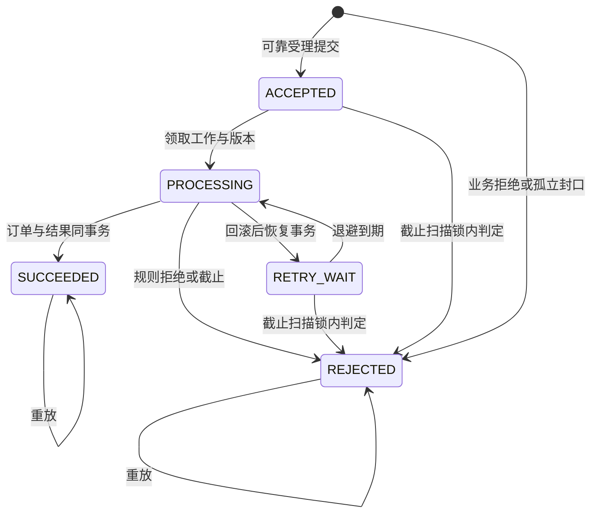
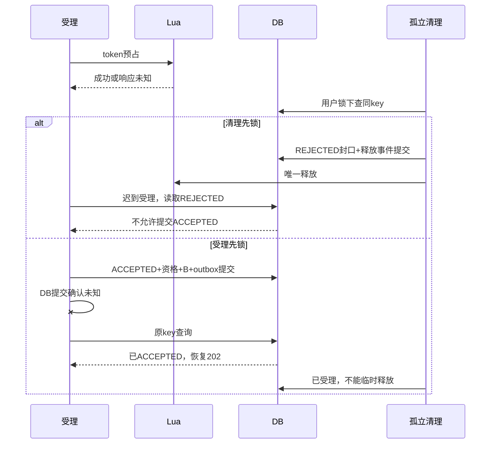
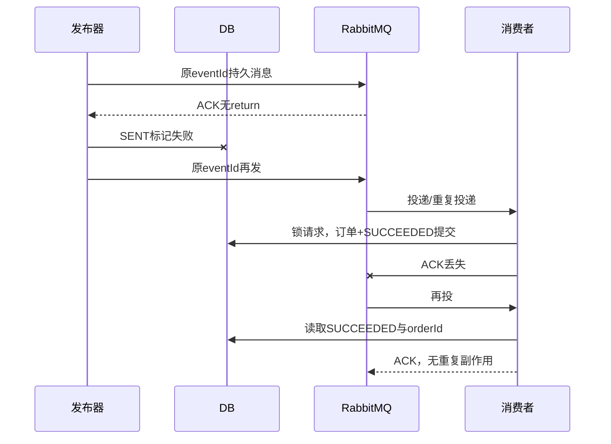
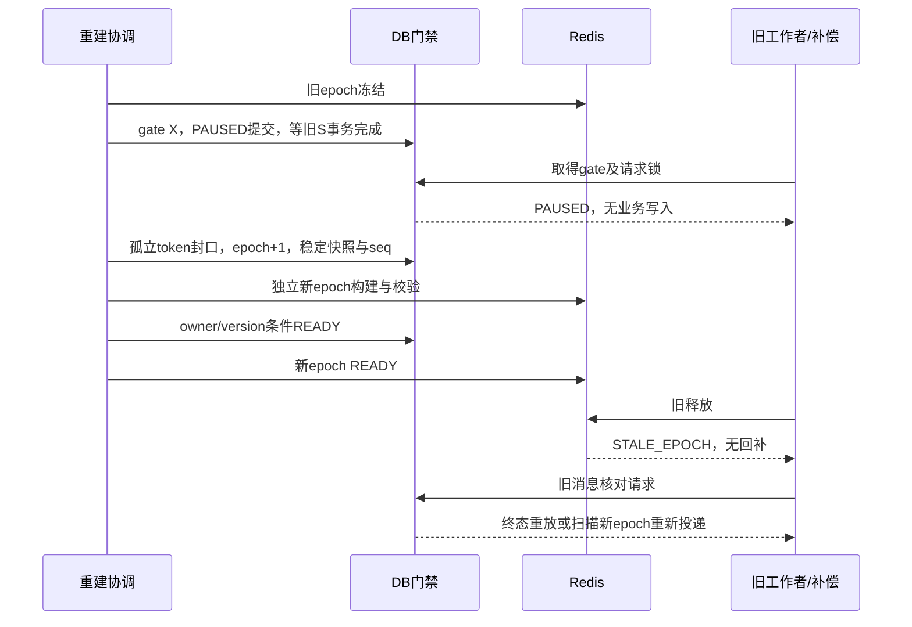

# TicketFlow V2 异步抢票协议

版本 v0.1，2026-10-06，批次 6 设计基线。本文是 [03_详细设计](03_详细设计.md)的 V2 增量附件；状态为“可审查、未实现”。Redis + Lua + RabbitMQ 已选定，Java 17、JdbcTemplate、统一分层保留。下面的状态机、接口和迁移不是已运行功能；真实跨组件故障验证安排在批次 8～10。2026-10-07环境补充：免费云中间件已运行并完成协议烟测，应用/MySQL保留本机，详见部署第7节与09计划第9节；不将组件连通作为本协议业务验收。

## 1. 权威事实与不变量

MySQL 保存订单、库存、持久受理与资格，Redis 是可恢复的预占视图。202 只在受理记录、在途资格、计数及发件箱一起提交之后返回。Redis成功、MQ收到消息均不等于订单成功。

场次统一为 SYNC/ASYNC，所有票档同模式。仅未开售、无历史订单、无在途请求和临时预占时配置；首次开售后不切换。旧同步建单遇 ASYNC 返回409 ASYNC_REQUIRED并指向新入口，SYNC仍成功201。ASYNC初次配置保持PAUSED，预占视图准备后才READY。

同用户/场次最多有一个在途资格或有效订单资格；两个资格表的独立唯一键不构成联合唯一，必须共享用户行锁并同时核查。排队不能撤回；成功后使用原取消接口。SUCCEEDED表示历史建单成功，订单后来取消/退款仍保留该结果，currentOrderStatus单独返回。

令 A=DB.available，R=reserved，S=sold，B=已受理未建单数量。保持 capacity=A+R+S，0≤B≤A。B在独立计数表，不冒充原库存reserved或无订单的库存流水。

| 原子数据库动作 | 变化 |
| --- | --- |
| 可靠受理 | B+1，新增在途资格及事件 |
| 建单 | B−1、A−1、R+1；在途资格转订单资格；请求成功 |
| 受理失败 | B−1、删除在途资格；请求失败及释放事件 |
| 支付 | R−1、S+1；无回补 |
| 取消/关单 | R−1、A+1；释放订单资格及投影事件 |
| 退款 | S−1、A+1；释放订单资格及投影事件 |

Redis追平且无临时预占时 free=A−B；临时预占也扣free。释放投影延迟可以少放票。禁止以绝对余额覆盖free，因为可能覆盖尚未入库的Lua预占。

## 2. 请求与工作状态

Redis TENTATIVE不是数据库已受理状态。ACCEPTED/PROCESSING/RETRY_WAIT占B及在途资格；终态不能互转。原tf_request不允许已提交PROCESSING的规则保持原样，仅新异步表允许工作租约。

锁齐后新SQL取UTC微秒时间：acceptedAt=now，createDeadline=min(now+30s,saleEndAt,startsAt)，消费者要求decisionTime严格小于三个截止；支付期限从实际建单decisionTime计算，仍最多15分钟且不超过开场。重建/重试不延长截止。正常30s终态和依赖恢复后100在途60s终态为验收目标，尚未验证。

初始工作租约8s，交易预算5s。领取短事务更新PROCESSING、work_version+1、owner、lease_until及attempt_count；实际交易另开事务，重查版本、owner、租约及期限。扫描器先取得用户/请求锁才可更换版本或拒绝；若实际交易已持锁，扫描等待其提交/回滚。租约过期不能直接释放。旧工作者版本不匹配不得提交。系统异常整笔回滚，恢复事务记录RETRY_WAIT；初始1/2/4/8s退避、最多5次执行，仍受截止限制。超阈值进入死信/告警但数据库扫描仍负责截止收敛，不遗忘请求。

## 3. 接口草案与边界

| 操作 | 输入与结果 | 权限 |
| --- | --- | --- |
| POST /api/v1/purchase-requests | tierId正BIGINT字符串、quantity=1；Idempotency-Key沿用16～64格式。受理后202，Location结果地址；requestId UUID字符串、state、acceptedAt、createDeadline、orderId、failureCode、currentOrderStatus | 当前用户 |
| GET /api/v1/purchase-requests/{id} | 200返回持久状态；成功附orderId、快照及当前状态；失败附稳定原因；非终态Retry-After:1 | 本人；他人/不存在统一404 |
| PUT /api/v1/admin/sessions/{id}/purchase-mode | mode、expectedVersion；成功200、版本递增及审计同事务 | ADMIN；epoch和phase不由客户端指定 |

统一ApiResponse、UTC ISO时间、服务端价格、每次traceId保留。原键同参复用requestId，replayed=true；异参409。原已受理请求非终态POST返回202，终态返回200；受理前业务拒绝持久REJECTED，返回原409及requestId，之后POST重放原拒绝HTTP结果。GET终态始终200。SYNC场次异步入口409 SYNC_REQUIRED。

429不消耗原键，附Retry-After。503提交未知返回retryWithSameKey=true，能确定requestId时附它，绝不说“没有受理”。GET404只说明此刻无可见持久记录，不证明没有Redis临时预占；客户端继续重试原POST键。校验/认证失败不落业务请求；禁用账号维持既有认证拒绝，系统回收不跳过禁用用户。

无法路由的不存在票档404、非ASYNC场次SYNC_REQUIRED以及未进入有效ASYNC准入的模式/参数预检拒绝，不创建异步请求；其响应data不伪造requestId。进入有效ASYNC准入后的售空/限购等业务拒绝才持久化原键终态。复合FK因此只引用实际存在且归属已核实的票档。原键已存在的结果始终先重放，不能因为后来模式/销售配置改变而覆盖。

认证→原键DB查询→已有结果重放，先于新请求限流。无DB行但Redis同键已有预占走恢复额度；结果查询独立额度。SOLD_OUT、PURCHASE_LIMIT、RATE_LIMITED、ASYNC_PAUSED、ADMISSION_EXPIRED、PROCESSING_DEADLINE_EXCEEDED、DEPENDENCY_UNAVAILABLE分别统计。新受理Redis故障时暂停，不切换到无Lua的异步受理；SYNC路径独立继续。当前已实现OpenAPI保持0.5.0，新契约见[草案索引](api/v2-draft.md)，实现后才加入正式OpenAPI。

## 4. 数据库增量

评审DDL见[async-schema-draft.sql](assets/03/v2/async-schema-draft.sql)，不放运行Flyway目录、不执行。下一个迁移编号按实际历史递增，不能回改V1。现有场次默认SYNC；先加表回填门禁/计数，再部署默认关闭代码，再完成迁移与回归，才开启ASYNC。

| 结构 | 关键字段及约束 |
| --- | --- |
| tf_session增purchase_mode | SYNC默认，CHECK SYNC/ASYNC；沿用version |
| tf_async_gate | session_id PK/FK，epoch>0，phase PAUSED/REBUILDING/READY，maintenance_version/owner，updated_at；所有场次建档 |
| tf_async_request | UUID id、user/session/tier、request_key/hash、token唯一（未预占直接拒绝可空）、epoch、state、accepted_at/deadline、order_id唯一、原结果/http_status、work_version/owner/lease、attempt/next_retry及时间；UNIQUE(user,key)，票档/订单归属复合FK，状态字段CHECK |
| tf_async_slot | PK(user,session)、request_id UNIQUE及(user,session,request)复合FK；仅持久非终态 |
| tf_async_tier_balance | tier_id PK/FK、queued_count≥0、projection_version≥0；与stock锁内联合校验B≤A |
| tf_outbox | event UUID、destination BROKER/REDIS、类型、aggregate/session/tier/epoch、projection_seq、JSON payload、PENDING/SENDING/SENT、版本/租约/退避/创建发送时间；UNIQUE(tier,projection_seq)、可发送索引 |

跨表B≤A与两种资格联合唯一不是DDL CHECK能证明的，必须靠锁协议及对账。异步结果与原tf_request分离；每个成功异步请求只关联一个订单，订单允许继续原生命周期。请求/原键封口/投影证据本轮不自动清理。未受理直接拒绝acceptedAt/deadline可空，order_id必须空；SUCCEEDED必须有订单，REJECTED必须有结果原因。

## 5. 锁顺序与代码职责

门禁在用户之前。正常gate S允许并行，维护gate X阻断相关写入。路由先只读查场次/owner，再按锁序重读核对。生命周期只锁自己的owner；不得因Redis资格属于别人而锁另一用户。

| 操作 | 顺序 |
| --- | --- |
| SYNC建单、ASYNC持久受理/孤立封口 | gate S→user X→对应请求X/唯一插入→event/session/tier S→两种资格→stock X→balance X→新行及事件 |
| 异步建单/失败/截止扫描 | gate S→owner X→async_request X→目录S（建单）→两种资格→stock X→balance X→订单/结果/事件 |
| ASYNC已有订单生命周期 | gate S→owner X→原tf_request X（系统无）→order X→订单资格及关联async_request→stock X→balance X→生命周期与事件 |
| 模式修改/重建 | gate X（多场次ID升序）→管理员X（自动任务无）→父到子目录→库存/计数 |
| 发件箱领取/确认标记 | 独立短事务仅outbox；网络在事务外，不反向锁业务表 |

SYNC已有订单生命周期保持V1；SYNC新下单也取gate S，防止模式配置与同步下单竞争。原下架/文案操作仍管理员→目录，不取gate、不回写余额；可能改变ASYNC容量/时间的未开售修改必须先gate X、暂停并重建。新场次在目录事务中建档gate，此时不存在旧gate持有者。

gate非READY时新异步受理、消费与ASYNC生命周期暂拒/退避503，同步场次和本人只读继续。维护暂停会短时影响ASYNC支付/取消，必须计入停顿；不承诺维护期间全部业务可写。持锁交易不调用Redis/MQ，不复用HTTP入口时间，不将长期队列塞入V1执行器。

统一包：controller/PurchaseRequestController，service/PurchaseRequestService、AsyncOrderService、OutboxPublisher、RedisProjectionService、AsyncRecoveryJob，mapper/AsyncRequestMapper、OutboxMapper，model区分dto/vo/entity，config装配Redis/MQ。监听器只解析信封调用Service；Service控制事务，Mapper只绑定SQL。复用库存/订单规则，新增门禁前缀必须同时覆盖同步入口和已有ASYNC订单生命周期。

## 6. Lua预占与可靠受理

键 `tf:<env>:async:{sessionId}:e:<epoch>:...` 同场次hash tag，含READY、票档free、token状态、user→token资格、user+key摘要→token、临时token索引和last_projection_seq。Lua先验证键类型、输入、门禁/epoch、Redis TIME与余量，再写去重/限购/free−1/TENTATIVE。脚本原子执行不等于报错自动回滚已经发生的写入，所有可失败校验必须在首次写前完成。[Redis官方Lua说明](https://redis.io/docs/latest/develop/programmability/eval-intro/)。

1. 校验认证→查DB原键；新键生成request UUID和不可猜token，Lua预占。同键Lua返回原id/token/hash，不重复扣free；异参冲突。
2. Lua响应未知原键重试，不按异常直接释放。临时预占首次时间保持不变，提交期限初值10s；它是触发检查的阈值，没有自动回补TTL。Redis不可用/键缺失拒绝新受理，不从DB.available直接初始化。
3. DB受理按锁序检查gate READY、epoch、可信适配器的token/id/hash/首次预占期、账号、销售窗口、两类资格、B<A；新SQL计算acceptedAt/deadline。插ACCEPTED+slot+B+1+CREATE_ORDER发件箱+ACTIVATE投影事件。全部提交后才202。
4. Redis TIME仅检查临时准入年龄，最终时间由DB判定。记录两端时钟偏差，超过初值1s暂停受理/告警，禁止无校验接受客户端伪造token时间。云端必须同步时钟。临时预占超期不自动说明未入库。
5. 数据库提交未知，保持原token/原key查已提交结果；未查到时可继续受理或走封口，不执行无依据回补。原key业务拒绝也持久化，确保售空等结果不可因后来回补变成成功；429不固化。
6. 孤立清理取得同样gate→user→请求锁：若无行，插原id/token/hash的REJECTED封口及RELEASE事件；若已受理，交正常截止扫描；若SUCCEEDED，绝不能释放订单；若已REJECTED重放原事件。封口事务提交后才能Lua释放。

Lua直接返回售空/限购且没有扣free时，也可持久化原键REJECTED，但token为空且不创建RELEASE事件；不能凭“拒绝”两个字多补一张票。Lua重复返回已有TENTATIVE时，必须复用其原requestId/token，不能用此次新生成的候选ID覆盖。只有明确成功取得预占的拒绝或孤立清理才写释放事件。

跨场次同key的额外窗口：Lua键按场次分组，不能原子保证全用户key唯一，因此两个场次可能暂时产生两个token。DB的UNIQUE(user,key)及用户锁决定唯一胜者。发现原键已有另一token时，先核对hash，复用胜者结果或返回409；当前候选token永不转ACCEPTED。已有原键行就是它的数据库栅栏，必须只为候选token安排释放，不能因胜者ACCEPTED而把它误留给胜者截止扫描，也不能释放胜者token。

这种候选释放以服务端由RELEASE+token确定的UUID作为eventId，用户锁内先查已有事件，存在则重放，不再分配新seq；不存在才在候选票档stock/balance锁内生成事件。同key封口与原结果永久保留，候选迟到入库始终被原键挡住。复用跨场次胜者结果时只读原行，不在候选gate下修改另一场次的请求。未来测试必须包含同key跨场次并发Lua成功、hash冲突、候选重复清理及胜者仍可完成。

第6步防止“清理已加库存，原HTTP随后又提交”。清理先取得用户锁，迟到受理只能读到REJECTED；受理先提交，清理看到ACCEPTED不释放。拒绝无锁“查一次DB然后释放”、只靠token TTL、只靠租约超时。临时索引损坏无法可信定位user/key时暂停场次，不猜测释放。

## 7. 消息和投影协议

RabbitMQ durable direct exchange、persistent消息、durable quorum工作队列，单节点学习环境复制数1，不宣称HA。发布confirm ACK且无mandatory return才标记SENT；confirm不是消费完成。[官方确认机制](https://www.rabbitmq.com/docs/confirms)，[quorum队列](https://www.rabbitmq.com/docs/quorum-queues)。

发布器领取最多100条、短租约、claim_version，领取事务结束才发消息；确认后版本条件标记。NACK/return/断连/未知确认保留事件，1/2/4/8/30s退避，告警不删除。消息成功但SENT标记失败，原eventId再发。信封schemaVersion、eventId、requestId、sessionId、epoch、createdAt、traceId，不含JWT/密码/客户端金额；路由字段不替代DB事实。

消费者手动ACK，初始并发4、prefetch8。读取终态直接ACK；非终态按第2/5节领取工作与锁后建单。成功同事务B−1、在途资格转订单资格、PENDING/快照、A−1/R+1、RESERVE、SUCCEEDED/orderId、MATERIALIZE事件；规则失败REJECTED/B−1/删资格/RELEASE事件。提交后ACK。提交后ACK丢失再投只重放。不能以Rabbit delivery tag作为跨重启业务去重键。

系统故障先提交RETRY_WAIT、next_retry和下一CREATE_ORDER事件，才ACK原消息；恢复写也失败则不ACK、停止受影响通道，等重投及独立扫描。拒绝无限nack(requeue=true)热循环，也拒绝先ACK后再发下一条。坏信封/版本进隔离死信并告警，不以不能解析的消息释放库存。达到执行阈值的持久请求仍由每2s/每批100/每轮5s截止扫描负责终态收敛。

Redis投影事件由REDIS目的地发件箱直接Lua执行，不再绕MQ。stock/balance锁内为每票档递增连续projection_version；事件唯一(tier,seq)。每票档Lua只接受last_seq+1；更旧幂等返回，跳跃GAP从DB补齐，不跳过。不同票档可并行；投影标记未知重放原事件不二次回补。

| 事件 | Redis效果 |
| --- | --- |
| ACTIVATE | TENTATIVE→ACCEPTED，不再次扣free |
| MATERIALIZE | 绑定orderId，不改free |
| RELEASE（失败/取消/关单/退款） | 校验epoch/token/尚未释放，再free+1；删除资格须比较owner token，不能删除后来新请求资格 |

成功请求与取消/退款订单可以同时存在。支付不回补。DB生命周期与投影事件共同提交，唯一流水及原结果保证事件只产生一次有效释放。不能将TTL、查询失败或未知提交直接转换为RELEASE。缺token/负free/无法补齐事件暂停并重建，不猜测余额。AOF everysec、noeviction作为候选配置，但临时预占丢失可发生；DB已受理事实必须可重建。事件不使用绝对free覆盖。

## 8. 六个故障窗口

| 窗口 | 恢复依据 |
| --- | --- |
| Lua成功、DB未提交 | 用户锁内同key受理/REJECTED封口；终态提交后释放 |
| DB提交未知 | 原key读DB，不按503回补 |
| 消息进队、发送标记未提交 | 原eventId重投+消费者状态去重 |
| 订单提交、ACK丢失 | 已SUCCEEDED直接ACK |
| 补偿与原请求并发 | user/request锁、终态、work_version；超时不是释放证据 |
| 重建后旧消息再到达 | epoch拒绝旧Lua；DB判断终态/非终态新投递 |

## 9. 重建与恢复

1. Redis故障或关键键缺失暂停新受理并告警。能访问时先冻结旧Redis epoch；DB gate X提交PAUSED，等待先行gate S事务结束，阻止受理、消费、ASYNC生命周期写。无法访问Redis也不影响DB门禁。迟到Lua只能留下未可靠受理临时预占。
2. 暂停该场次投影器，脚本本身也检查READY/epoch。旧临时token可读取时逐项封口；已受理交截止恢复。Redis全丢失时，未提交token无受理承诺；旧HTTP的epoch不再可用，原key由DB判定，不能换key重复接受。
3. gate X记录REBUILDING、epoch+1、maintenance owner/version，事务提交后做网络。稳定只读RR读取有效订单、非终态请求/资格、B、库存、projection_seq水位；所有相关写仍暂停。差异存在保持PAUSED，不开放。
4. 在新epoch独立命名空间建立free=A−B、订单PENDING/PAID和在途请求active token、资格map与每票档last_seq=snapshot_seq。请求绑定原token、effective epoch更新；已包含快照水位以前变化的投影不再回补。全量检查守恒与映射。
5. 网络未知可重建临时命名空间，不能增量重复加票；发布新active epoch但仍PAUSED。DB核对维护owner/version/epoch后READY提交，再原子开启同epoch Redis READY。中间窗口暂拒；崩溃恢复必须验证完整快照，不能只看DB READY盲目初始化。
6. 消费/投影/生命周期恢复，扫描非终态请求重新投递新epoch。已过截止先REJECTED；重建不延长deadline。旧释放Lua STALE_EPOCH无副作用；旧消息若请求非终态，不能只因旧epoch丢弃后遗忘，DB扫描负责新投递。旧维护者/工作者版本失效。

初始单场次维护预算30s，超预算保持暂停告警。依赖恢复后100个在途60s收敛目标必须实测，不能把维护时间剔除来规避失败。自动重建不承诺永久数据盘丢失恢复。多副本HA不在本轮。

## 10. 对账、测试与决策

新增B与非终态数量一致、在途资格完整、两种资格无重复、成功请求订单归属唯一、失败无在途、Lua临时/已受理/订单token、孤立预占、seq连续/事件进度、重复回补等核对。跨组件在线采样不是同一事务快照，记录epoch/seq/时间并重试确认；严格断言使用暂停与追平的稳定切面。

批次8～10必须验证：同键异参/重复消息、跨票档限购、模式切换门禁、锁后截止/禁用/下架、Lua响应丢失、孤立封口与晚提交、DB提交未知、confirm/return/SENT未知、ACK丢失、租约过期与旧工作者、死信/截止扫描、重复乱序投影、取消退款回补、重建每步崩溃与旧epoch、100在途恢复。设计模型检查不能替代上述真实组件验证。

决策：采用数据库发件箱并承担可靠受理写入成本；否决纯Redis返回202、直接发MQ后建单、TTL自动回补、未知提交立即补偿、绝对余额覆盖。收益由同资源实测判断，异步和学习目标不等于数据库已是瓶颈。组件协议依据取自官方资料，业务栅栏与状态规则是TicketFlow自身设计，尚待实现验证。
