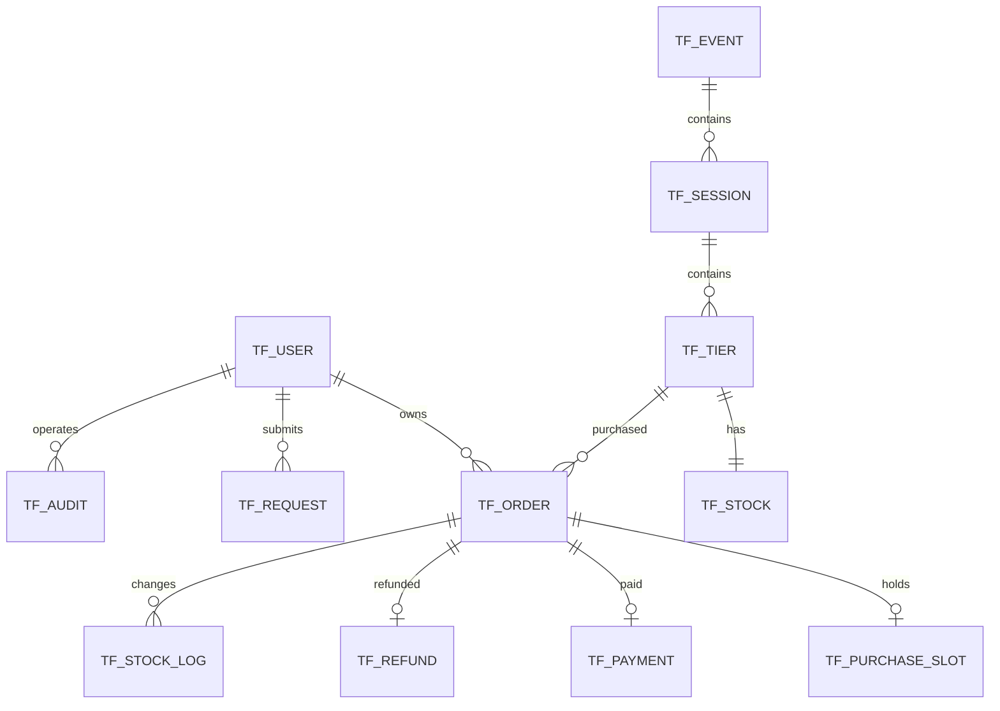
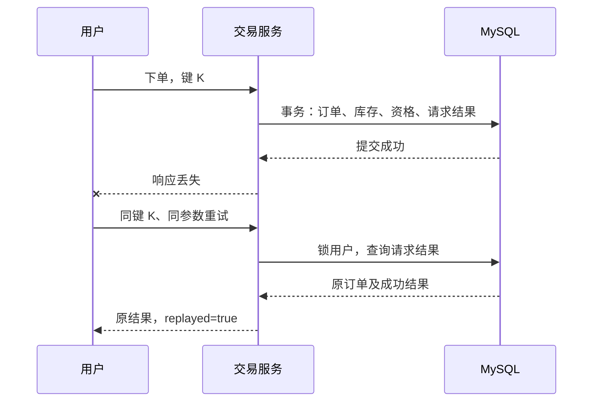
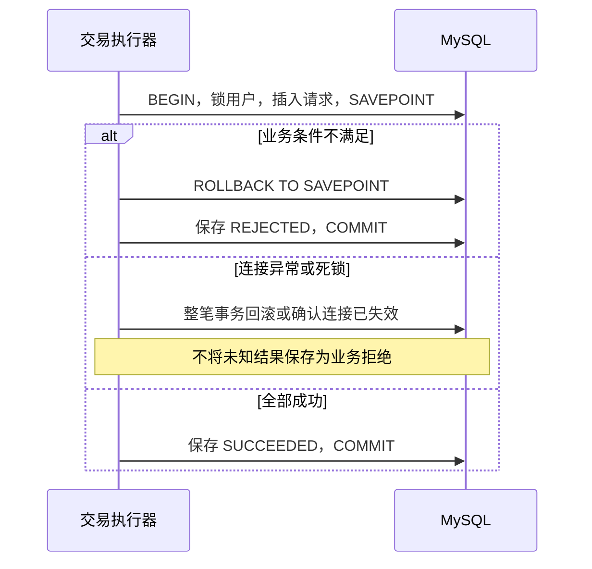

# TicketFlow 详细设计

| 文档信息 | 内容 |
| --- | --- |
| 项目名称 | TicketFlow —— 高并发智能票务平台 |
| 文档状态 | 已基线 |
| 当前版本 | v1.6 |
| 创建日期 | 2026-09-28 |
| 最近更新 | 2026-10-04 |
| 适用阶段 | 阶段 3：V1 详细设计 |
| 上游文档 | [01_需求分析.md](01_需求分析.md)、[02_总体设计.md](02_总体设计.md)，均为 v1.0 |

## 1. 范围与实现约束

本文细化 V1 Java 单体的数据库、接口、事务、状态、类职责与验证场景。认证、目录、订单生命周期及批次 5 的管理订单、统计和只读对账已实现。真实故障恢复及性能实测结果见测试报告与阶段 06；测试结果与设计要求分别记录。

沿用既有业务基线：每单一张、同用户同场次最多一个有效订单、15 分钟支付期限且不超过开场时间、开场前全额模拟退款。V2 异步抢票和 V3 Agent 不在本次实施范围内。

### 1.1 数据与时间约定

- 数据库使用 MySQL 8.0.45、InnoDB、utf8mb4；连接时区固定为 UTC。
- 业务时间用 `DATETIME(6)` 存储 UTC，接口用 ISO 8601 UTC 字符串；客户端按 Asia/Shanghai 展示。
- 金额使用 `BIGINT` 存人民币分，V1 单价范围 1—100,000,000 分；Java 使用 long，不用浮点数。
- 主键用数据库生成的 BIGINT；对外所有 ID 用十进制字符串，避免 JavaScript 精度问题。
- 账号注册先转换 ASCII 小写，密码不 trim、不截断；账号、请求键的数据库比较采用区分大小写的二进制排序规则。
- 名称 1—100 字符，城市 1—64，地点 1—255，介绍最多 10,000 字符；字符串先校验再持久化。容量 0—1,000,000 张。
- V1 不提供物理删除业务数据的接口。外键使用默认 RESTRICT 行为，不级联删除交易历史。

## 2. 数据模型

### 2.1 ER 关系



### 2.2 表职责与关键约束

| 表 | 归属 | 关键规则 |
| --- | --- | --- |
| tf_user | identity | 规范化账号唯一；USER / ADMIN 角色 |
| tf_event | catalog | DRAFT / ON_SALE / OFF_SALE；城市和地点归活动 |
| tf_session | catalog | 销售开始 < 销售结束 ≤ 开场；freeze_at 记录不可推迟的冻结边界 |
| tf_tier | catalog | 场次内票档名唯一；价格、退款政策版本 |
| tf_stock | inventory | 一票档一行；容量 = 可售 + 占用 + 已售；余额非负 |
| tf_order | order | 订单状态与快照；一单一张；复合外键保证票档所属场次一致 |
| tf_purchase_slot | order | 主键为用户与场次；有效资格关联唯一订单；订单终止后删除资格 |
| tf_request | trade | 用户、操作、请求键唯一；保存参数摘要、最终结果；PROCESSING 仅存在于未提交事务 |
| tf_payment | payment | 每订单最多一条成功模拟支付；失败保存在请求结果中 |
| tf_refund | payment | 每订单最多一条成功模拟退款；无部分退款 |
| tf_stock_log | inventory | 每订单每类变更最多一次，用于核对库存 |
| tf_audit | infrastructure | 管理员、动作、对象及修改前后快照，与管理变更共同提交 |

### 2.3 V1 建表定义

下述 DDL 为迁移初稿，后续放入 `backend/src/main/resources/db/migration/V1__init_schema.sql`。运行前由环境创建专用数据库和最小权限账号，本段不创建数据库、不重置已有数据。

```sql
CREATE TABLE tf_user (
  id BIGINT PRIMARY KEY AUTO_INCREMENT,
  username VARCHAR(32) CHARACTER SET ascii COLLATE ascii_bin NOT NULL,
  password_hash VARCHAR(255) NOT NULL,
  role VARCHAR(16) NOT NULL DEFAULT 'USER',
  enabled BOOLEAN NOT NULL DEFAULT TRUE,
  created_at DATETIME(6) NOT NULL,
  UNIQUE KEY uk_user_name (username),
  CHECK (role IN ('USER','ADMIN'))
) ENGINE=InnoDB DEFAULT CHARSET=utf8mb4;

CREATE TABLE tf_event (
  id BIGINT PRIMARY KEY AUTO_INCREMENT,
  name VARCHAR(100) NOT NULL,
  description TEXT NOT NULL,
  category VARCHAR(32) NOT NULL,
  city VARCHAR(64) NOT NULL,
  venue VARCHAR(255) NOT NULL,
  status VARCHAR(16) NOT NULL DEFAULT 'DRAFT',
  version BIGINT NOT NULL DEFAULT 0,
  created_at DATETIME(6) NOT NULL,
  updated_at DATETIME(6) NOT NULL,
  KEY idx_event_list (status, city, category, id),
  CHECK (status IN ('DRAFT','ON_SALE','OFF_SALE'))
) ENGINE=InnoDB DEFAULT CHARSET=utf8mb4;

CREATE TABLE tf_session (
  id BIGINT PRIMARY KEY AUTO_INCREMENT,
  event_id BIGINT NOT NULL,
  starts_at DATETIME(6) NOT NULL,
  sale_start_at DATETIME(6) NOT NULL,
  sale_end_at DATETIME(6) NOT NULL,
  freeze_at DATETIME(6) NOT NULL,
  version BIGINT NOT NULL DEFAULT 0,
  created_at DATETIME(6) NOT NULL,
  updated_at DATETIME(6) NOT NULL,
  KEY idx_session_event (event_id, id),
  FOREIGN KEY (event_id) REFERENCES tf_event(id),
  CHECK (sale_start_at < sale_end_at AND sale_end_at <= starts_at),
  CHECK (freeze_at <= sale_start_at)
) ENGINE=InnoDB DEFAULT CHARSET=utf8mb4;

CREATE TABLE tf_tier (
  id BIGINT PRIMARY KEY AUTO_INCREMENT,
  session_id BIGINT NOT NULL,
  name VARCHAR(100) NOT NULL,
  price_fen BIGINT NOT NULL,
  refund_policy VARCHAR(32) NOT NULL DEFAULT 'FULL_BEFORE_START_V1',
  version BIGINT NOT NULL DEFAULT 0,
  created_at DATETIME(6) NOT NULL,
  updated_at DATETIME(6) NOT NULL,
  UNIQUE KEY uk_tier_name (session_id, name),
  UNIQUE KEY uk_tier_session (id, session_id),
  FOREIGN KEY (session_id) REFERENCES tf_session(id),
  CHECK (price_fen BETWEEN 1 AND 100000000),
  CHECK (refund_policy = 'FULL_BEFORE_START_V1')
) ENGINE=InnoDB DEFAULT CHARSET=utf8mb4;

CREATE TABLE tf_stock (
  tier_id BIGINT PRIMARY KEY,
  capacity INT NOT NULL,
  available INT NOT NULL,
  reserved INT NOT NULL DEFAULT 0,
  sold INT NOT NULL DEFAULT 0,
  updated_at DATETIME(6) NOT NULL,
  FOREIGN KEY (tier_id) REFERENCES tf_tier(id),
  CHECK (capacity BETWEEN 0 AND 1000000),
  CHECK (available >= 0 AND reserved >= 0 AND sold >= 0),
  CHECK (capacity = available + reserved + sold)
) ENGINE=InnoDB DEFAULT CHARSET=utf8mb4;

CREATE TABLE tf_order (
  id BIGINT PRIMARY KEY AUTO_INCREMENT,
  user_id BIGINT NOT NULL,
  session_id BIGINT NOT NULL,
  tier_id BIGINT NOT NULL,
  status VARCHAR(16) NOT NULL,
  quantity INT NOT NULL DEFAULT 1,
  unit_price_fen BIGINT NOT NULL,
  amount_fen BIGINT NOT NULL,
  snapshot JSON NOT NULL,
  starts_at DATETIME(6) NOT NULL,
  expires_at DATETIME(6) NOT NULL,
  created_at DATETIME(6) NOT NULL,
  updated_at DATETIME(6) NOT NULL,
  UNIQUE KEY uk_order_owner_session (id, user_id, session_id),
  KEY idx_order_user (user_id, id),
  KEY idx_order_expiry (status, expires_at, id),
  KEY idx_order_session (session_id, status, id),
  KEY idx_order_created (created_at, id),
  FOREIGN KEY (user_id) REFERENCES tf_user(id),
  FOREIGN KEY (tier_id, session_id) REFERENCES tf_tier(id, session_id),
  CHECK (status IN ('PENDING','PAID','CANCELLED','CLOSED','REFUNDED')),
  CHECK (quantity = 1 AND unit_price_fen BETWEEN 1 AND 100000000),
  CHECK (amount_fen = unit_price_fen),
  CHECK (created_at < expires_at AND expires_at <= starts_at)
) ENGINE=InnoDB DEFAULT CHARSET=utf8mb4;

CREATE TABLE tf_purchase_slot (
  user_id BIGINT NOT NULL,
  session_id BIGINT NOT NULL,
  order_id BIGINT NOT NULL,
  PRIMARY KEY (user_id, session_id),
  UNIQUE KEY uk_slot_order (order_id),
  FOREIGN KEY (order_id, user_id, session_id)
    REFERENCES tf_order(id, user_id, session_id)
) ENGINE=InnoDB DEFAULT CHARSET=utf8mb4;

CREATE TABLE tf_request (
  id BIGINT PRIMARY KEY AUTO_INCREMENT,
  user_id BIGINT NOT NULL,
  operation VARCHAR(16) CHARACTER SET ascii COLLATE ascii_bin NOT NULL,
  request_key VARCHAR(64) CHARACTER SET ascii COLLATE ascii_bin NOT NULL,
  payload_hash CHAR(64) CHARACTER SET ascii COLLATE ascii_bin NOT NULL,
  state VARCHAR(16) NOT NULL,
  http_status SMALLINT NULL,
  result_code VARCHAR(64) NULL,
  result_json JSON NULL,
  order_id BIGINT NULL,
  created_at DATETIME(6) NOT NULL,
  completed_at DATETIME(6) NULL,
  UNIQUE KEY uk_request (user_id, operation, request_key),
  FOREIGN KEY (user_id) REFERENCES tf_user(id),
  FOREIGN KEY (order_id) REFERENCES tf_order(id),
  CHECK (operation IN ('CREATE','PAY','CANCEL','REFUND')),
  CHECK (state IN ('PROCESSING','SUCCEEDED','REJECTED')),
  CHECK ((state = 'PROCESSING' AND completed_at IS NULL)
    OR (state IN ('SUCCEEDED','REJECTED') AND completed_at IS NOT NULL
      AND http_status IS NOT NULL AND result_code IS NOT NULL
      AND result_json IS NOT NULL))
) ENGINE=InnoDB DEFAULT CHARSET=utf8mb4;

CREATE TABLE tf_payment (
  id BIGINT PRIMARY KEY AUTO_INCREMENT,
  order_id BIGINT NOT NULL,
  amount_fen BIGINT NOT NULL,
  paid_at DATETIME(6) NOT NULL,
  UNIQUE KEY uk_payment_order (order_id),
  KEY idx_payment_time (paid_at, id),
  FOREIGN KEY (order_id) REFERENCES tf_order(id),
  CHECK (amount_fen BETWEEN 1 AND 100000000)
) ENGINE=InnoDB DEFAULT CHARSET=utf8mb4;

CREATE TABLE tf_refund (
  id BIGINT PRIMARY KEY AUTO_INCREMENT,
  order_id BIGINT NOT NULL,
  amount_fen BIGINT NOT NULL,
  refunded_at DATETIME(6) NOT NULL,
  UNIQUE KEY uk_refund_order (order_id),
  KEY idx_refund_time (refunded_at, id),
  FOREIGN KEY (order_id) REFERENCES tf_payment(order_id),
  CHECK (amount_fen BETWEEN 1 AND 100000000)
) ENGINE=InnoDB DEFAULT CHARSET=utf8mb4;

CREATE TABLE tf_stock_log (
  id BIGINT PRIMARY KEY AUTO_INCREMENT,
  order_id BIGINT NOT NULL,
  movement VARCHAR(16) NOT NULL,
  delta_available INT NOT NULL,
  delta_reserved INT NOT NULL,
  delta_sold INT NOT NULL,
  created_at DATETIME(6) NOT NULL,
  UNIQUE KEY uk_stock_movement (order_id, movement),
  FOREIGN KEY (order_id) REFERENCES tf_order(id),
  CHECK ((movement = 'RESERVE' AND delta_available = -1
      AND delta_reserved = 1 AND delta_sold = 0)
    OR (movement = 'PAY' AND delta_available = 0
      AND delta_reserved = -1 AND delta_sold = 1)
    OR (movement = 'RELEASE' AND delta_available = 1
      AND delta_reserved = -1 AND delta_sold = 0)
    OR (movement = 'REFUND' AND delta_available = 1
      AND delta_reserved = 0 AND delta_sold = -1))
) ENGINE=InnoDB DEFAULT CHARSET=utf8mb4;

CREATE TABLE tf_audit (
  id BIGINT PRIMARY KEY AUTO_INCREMENT,
  actor_id BIGINT NOT NULL,
  action VARCHAR(32) NOT NULL,
  object_type VARCHAR(16) NOT NULL,
  object_id BIGINT NOT NULL,
  before_json JSON NULL,
  after_json JSON NOT NULL,
  trace_id VARCHAR(64) NOT NULL,
  created_at DATETIME(6) NOT NULL,
  KEY idx_audit_object (object_type, object_id, id),
  FOREIGN KEY (actor_id) REFERENCES tf_user(id)
) ENGINE=InnoDB DEFAULT CHARSET=utf8mb4;
```

支付与退款金额必须等于订单金额，由持锁的交易服务校验。有效资格必须且仅对应 PENDING / PAID 订单、库存余额与订单数量一致等跨表规则由事务协议和对账保证，不能声称单靠上述 CHECK 已保证。

### 2.4 快照与查询

`snapshot` 固定包含 `schemaVersion=1`、`eventId`、`eventName`、`city`、`venue`、`sessionId`、`startsAt`、`tierId`、`tierName`、`unitPriceFen`、`quantity=1`、`amountFen`、`refundPolicy`。订单列中的金额、时间与 JSON 在建单时由同一对象生成，JSON 不参与库存判断。

事件列表按 id 降序；订单列表按 id 降序。V1 使用页码分页，page ≥ 1、size 默认 20 且最大 100。筛选条件组合通过执行计划决定是否增加索引，不能认为一个联合索引自动覆盖所有可选筛选。名称包含搜索可先用参数化 LIKE，并对 `%`、`_` 作字面转义。

## 3. 事务执行器与锁协议

### 3.1 统一执行器

交易入口使用 `TransactionTemplate` 和单个 JDBC 事务管理器，隔离级别设为 READ COMMITTED。交易、订单、库存 Mapper 使用 JdbcTemplate，与认证 Mapper 共用同一数据源和事务连接；交易不使用查询缓存。认证的 MyBatis 二级缓存关闭且 `localCacheScope=STATEMENT`。

每次交易先锁用户行，作为 V1 同用户交易的串行入口。其代价是同用户不同场次也串行，但不同用户可以并发；购买资格唯一约束仍作为最终兜底。后台管理员操作也先锁当前管理员行，再操作目录；交易不锁其他用户行。

| 操作 | 固定加锁顺序 |
| --- | --- |
| 新下单 | 当前用户 X → 请求记录 → 活动 S → 场次 S → 票档 S → 检查存量资格 → 库存 X → 插入新订单与资格 |
| 支付、取消、退款、关单 | 订单所属用户 X → 请求记录（关单不需要）→ 订单 X → 资格 → 库存 X |
| 管理目录 | 当前管理员 X → 活动 X → 场次 X（id 升序）→ 票档 X（id 升序）→ 库存 X |

S 表示共享锁，X 表示排他锁。已有订单交易仅使用成交快照，不反向锁目录。支付等操作如先读订单以确定 user_id，该读取仅用于路由，获得用户锁后仍须锁订单并重新核对归属和状态。外部用户不能借此锁住他人交易。

管理发布校验时同样遵守父对象先锁；修改场次或票档不能先锁子对象再锁父对象。所有对象的归属关系创建后不变。死锁仍可能发生，不能宣称有固定顺序就绝不会死锁。

### 3.2 幂等与保存点

客户端交易请求必须携带 `Idempotency-Key`，格式 `[A-Za-z0-9_-]{16,64}`。参数摘要为稳定字段序列的 SHA-256，包含操作版本、路径订单 ID 或票档 ID、quantity；不包含 JWT、追踪编号或时间。相同参数生成相同摘要。

```text
认证、校验参数（失败直接返回，不写业务请求表）
  → 开启事务并锁用户
  → 查询 user_id + operation + request_key
      → 已存在：核对摘要，返回原操作结果
      → 不存在：插入 PROCESSING（尚未提交）
  → 创建保存点 business_start
  → 执行业务
      → 成功：保存 SUCCEEDED 和结果
      → 已知业务拒绝：回滚到保存点，保存 REJECTED 和结果
      → SQL / 连接 / 系统异常：整个事务回滚，不记录虚假的业务失败
  → 提交，之后才发送响应
```

`BusinessRejection` 仅表示已知规则拒绝，由执行器捕获；不能先被内层 `@Transactional` 标记 rollback-only 再试图提交拒绝结果。业务协作者不另开事务、不使用 REQUIRES_NEW。保存点由 Spring TransactionStatus 的保存点能力操作，回滚后重建响应对象，不能复用未提交订单实体。

数据库异常、唯一约束意外冲突、死锁、锁等待超时均退出整笔事务，不按业务拒绝吞掉。仅已知可恢复的死锁/锁超时在事务外最多重试 2 次，间隔建议 20—100 ms 抖动；总请求预算到达即停止。每次重新开始完整事务且保留原请求键。

请求记录的参数化 SQL 如下。插入发生在业务保存点之前，最终更新发生在业务成功后或回滚到保存点之后；终态更新影响行数必须为 1。

```sql
INSERT INTO tf_request
 (user_id, operation, request_key, payload_hash, state, created_at)
VALUES (:userId, :operation, :requestKey, :payloadHash, 'PROCESSING', :requestTime);
-- Spring 创建保存点并执行业务，必要时回滚至保存点。
UPDATE tf_request
 SET state = :terminalState, http_status = :httpStatus,
     result_code = :resultCode, result_json = :resultJson,
     order_id = :resultOrderId, completed_at = :completedAt
 WHERE id = :requestId AND state = 'PROCESSING';
```

`terminalState` 仅可为 SUCCEEDED / REJECTED，`resultOrderId` 仅引用实际存在且属于当前用户的订单；被保存点撤销的新订单 ID 必须清空。requestTime 用于记录受理，不能代替后面的业务 decisionTime。

事务正常结束前强制检查请求结果为终态，绝不单独提交 PROCESSING。V1 不需要“处理中请求补偿任务”：崩溃会回滚未提交状态。提交结果未知则返回 503 和 `retryWithSameKey=true`，客户端保留同键重试以查询结果。

同键重放保持原业务结果与 HTTP 状态；`traceId` 为本次请求编号，另返回 `replayed=true`。可额外读取 `currentOrderStatus`，与原操作结果区分。原订单已取消也不能复用 CREATE 请求键生成新订单。V1 请求记录不自动清理，避免清理后重放产生第二次副作用。

参考：[Spring 编程式事务](https://docs.spring.io/spring-framework/reference/data-access/transaction/programmatic.html)、[MySQL 保存点](https://dev.mysql.com/doc/refman/8.4/en/savepoint.html)、[MyBatis 缓存配置](https://mybatis.org/mybatis-3/configuration.html)。保存点与事务管理器组合需用真实 MySQL 集成测试验证。

### 3.3 时间判定点

获取业务所需的全部锁后，以新语句 `SELECT UTC_TIMESTAMP(6)` 取得 `decisionTime`。不复用进入 HTTP 请求时的时间，也不复用可能等待行锁的 SQL 开始时刻。

下单在库存锁到手后重查销售窗口，以 decisionTime 为 created_at；支付在订单及库存锁到手后检查 `decisionTime < expires_at`；退款检查 `decisionTime < starts_at`。这些时刻作为业务动作判定点，提交可略晚于它。事务预算初始设为 5 秒，禁止在取时之后执行外部调用或人为等待。

## 4. 核心交易 SQL 与状态转换

下面使用 `:parameter` 表示绑定参数，不能直接复制为无参数脚本运行。JdbcTemplate 实现使用 `?` 参数绑定，不拼接用户字符串。所有写操作检查影响行数，除查询重放外关键单行变更应等于 1。

### 4.1 下单

锁用户与请求结果后，按父到子锁定目录。票档 ID 对应的父 ID 可先只读查询用于路由，再用锁定查询核实存在与归属；不存在作为已知拒绝。

```sql
SELECT id, enabled FROM tf_user WHERE id = :userId FOR UPDATE;
SELECT * FROM tf_request
 WHERE user_id = :userId AND operation = 'CREATE'
   AND request_key = :requestKey FOR UPDATE;
-- 无记录时 INSERT tf_request，再由事务执行器建立保存点。
SELECT * FROM tf_event WHERE id = :eventId FOR SHARE;
SELECT * FROM tf_session WHERE id = :sessionId AND event_id = :eventId FOR SHARE;
SELECT * FROM tf_tier WHERE id = :tierId AND session_id = :sessionId FOR SHARE;
SELECT order_id FROM tf_purchase_slot
 WHERE user_id = :userId AND session_id = :sessionId FOR UPDATE;
SELECT * FROM tf_stock WHERE tier_id = :tierId FOR UPDATE;
SELECT UTC_TIMESTAMP(6) AS decision_time;
```

若资格存在返回 PURCHASE_LIMIT；若状态或时间不可售返回相应拒绝；available=0 返回 SOLD_OUT。拒绝回滚保存点并保存请求结果。所有检查通过后才执行：

```sql
INSERT INTO tf_order
 (user_id, session_id, tier_id, status, quantity, unit_price_fen,
  amount_fen, snapshot, starts_at, expires_at, created_at, updated_at)
VALUES
 (:userId, :sessionId, :tierId, 'PENDING', 1, :priceFen,
  :priceFen, :snapshotJson, :startsAt, :expiresAt, :decisionTime, :decisionTime);
-- 通过生成键取得 orderId；expiresAt=min(decisionTime+15分钟, startsAt)。
INSERT INTO tf_purchase_slot(user_id, session_id, order_id)
VALUES (:userId, :sessionId, :orderId);
UPDATE tf_stock
 SET available = available - 1, reserved = reserved + 1, updated_at = :decisionTime
 WHERE tier_id = :tierId AND available >= 1;
INSERT INTO tf_stock_log
 (order_id, movement, delta_available, delta_reserved, delta_sold, created_at)
VALUES (:orderId, 'RESERVE', -1, 1, 0, :decisionTime);
```

新订单和新资格在库存锁后插入，存量资格检查在库存锁之前，与第 3.1 节一致。保存成功请求结果后提交。自增 ID 回滚产生空洞是允许的，不把连续编号作为正确性条件。

### 4.2 支付

锁用户、请求记录、本人订单。若已经存在成功支付，返回原支付信息，不重复迁移；即使订单后来已退款也返回历史支付结果并附当前状态。若无成功支付，要求订单 PENDING。

锁资格和库存后重新取 decisionTime，过期则返回 ORDER_EXPIRED，由关单任务归还库存。模拟失败使用测试环境注入的失败适配器，返回 PAYMENT_SIMULATED_FAILURE，事务内业务变更撤销；正常路径：

```sql
UPDATE tf_order SET status = 'PAID', updated_at = :decisionTime
 WHERE id = :orderId AND user_id = :userId AND status = 'PENDING'
   AND expires_at > :decisionTime;
UPDATE tf_stock
 SET reserved = reserved - 1, sold = sold + 1, updated_at = :decisionTime
 WHERE tier_id = :tierId AND reserved >= 1;
INSERT INTO tf_payment(order_id, amount_fen, paid_at)
VALUES (:orderId, :amountFen, :decisionTime);
INSERT INTO tf_stock_log
 (order_id, movement, delta_available, delta_reserved, delta_sold, created_at)
VALUES (:orderId, 'PAY', 0, -1, 1, :decisionTime);
```

PAID 状态继续持有限购资格。库存余额不足、资格与订单不匹配视为内部一致性错误，整笔回滚并告警，不当作“售罄”。

### 4.3 取消与超时关闭

用户主动取消只针对 PENDING；已 CANCELLED 返回已有结果，已 CLOSED 返回“已关闭”且不释放；PAID / REFUNDED 拒绝取消。到期时用户取消统一执行 CLOSED，避免到期之后出现不同关闭口径。

系统任务无客户端幂等键，直接依赖订单状态与库存流水唯一约束。先定位 owner，再按用户、订单、资格、库存顺序锁定；重新取时后执行：

内部关单事务通过 `TradeExecutor.internal` 启动，不要求 owner 启用，但要求用户存在并锁定其行；因此禁用账号的过期占用仍可回收。该入口不向 HTTP 暴露。

```sql
-- 主动取消：targetStatus=CANCELLED 且 decisionTime < expiresAt。
-- 超时或到期后取消：targetStatus=CLOSED 且 decisionTime >= expiresAt。
UPDATE tf_order SET status = :targetStatus, updated_at = :decisionTime
 WHERE id = :orderId AND status = 'PENDING';
UPDATE tf_stock
 SET available = available + 1, reserved = reserved - 1, updated_at = :decisionTime
 WHERE tier_id = :tierId AND reserved >= 1;
DELETE FROM tf_purchase_slot
 WHERE user_id = :userId AND session_id = :sessionId AND order_id = :orderId;
INSERT INTO tf_stock_log
 (order_id, movement, delta_available, delta_reserved, delta_sold, created_at)
VALUES (:orderId, 'RELEASE', 1, -1, 0, :decisionTime);
```

上述两种时间条件在取得锁后校验，SQL 可进一步加入对应 expires_at 条件。订单状态更新影响零行时不得继续后续库存操作。资格删除影响零行属于一致性异常，回滚并定位原因。

### 4.4 退款

重复成功退款返回原退款记录。首次退款要求 PAID 且 decisionTime < starts_at；从订单和支付记录取得全额金额，不接受客户端金额。

```sql
UPDATE tf_order SET status = 'REFUNDED', updated_at = :decisionTime
 WHERE id = :orderId AND user_id = :userId AND status = 'PAID'
   AND starts_at > :decisionTime;
UPDATE tf_stock
 SET available = available + 1, sold = sold - 1, updated_at = :decisionTime
 WHERE tier_id = :tierId AND sold >= 1;
INSERT INTO tf_refund(order_id, amount_fen, refunded_at)
VALUES (:orderId, :amountFen, :decisionTime);
DELETE FROM tf_purchase_slot
 WHERE user_id = :userId AND session_id = :sessionId AND order_id = :orderId;
INSERT INTO tf_stock_log
 (order_id, movement, delta_available, delta_reserved, delta_sold, created_at)
VALUES (:orderId, 'REFUND', 1, 0, -1, :decisionTime);
```

模拟退款失败回滚业务部分，仅保留最终拒绝请求。新请求键可再次尝试；原键仍返回原失败。退款后的可售库存不绕过售票时间和活动上下架条件。

### 4.5 状态矩阵

| 当前订单状态 | 支付 | 主动取消 | 超时任务 | 退款 |
| --- | --- | --- | --- | --- |
| PENDING | 期限内转 PAID，否则拒绝 | 未到期转 CANCELLED，到期转 CLOSED | 到期转 CLOSED，否则跳过 | 拒绝 |
| PAID | 返回原支付 | 拒绝 | 跳过 | 开场前转 REFUNDED，否则拒绝 |
| CANCELLED | 拒绝 | 返回已取消 | 跳过 | 拒绝 |
| CLOSED | 拒绝 | 返回已关闭 | 跳过 | 拒绝 |
| REFUNDED | 返回历史支付与当前状态 | 拒绝 | 跳过 | 返回原退款 |

相同请求键的终态重放优先于本表的新请求处理。

## 5. 目录管理与冻结规则

活动创建为 DRAFT；发布至少需要一个场次且每个已配置场次至少一个完整票档与库存行，时间关系合法。首次发布和重新上架均执行完整校验；首次发布转 ON_SALE，下架转 OFF_SALE，重复目标状态返回当前结果。售票结束后仍可展示上架活动，但不可下单。ON_SALE 活动不得新增场次；管理员应先下架、配置完整后重新上架，避免公开空场次。

所有管理写请求携带 `expectedVersion`，锁对象后比较版本，不一致返回 VERSION_CONFLICT；成功修改版本加一。先判断目标状态已实现且内容一致时可以返回已有结果，避免重放上下架造成无意义版本增长。创建操作不带 version。

场次创建时 `freeze_at=sale_start_at`。开售前改时间时 `freeze_at=min(旧freeze_at, 新sale_start_at)`，不能推迟。持锁后若数据库当前时间 ≥ freeze_at，拒绝修改场次时间、票档名、价格、容量和退款规则，也不允许为该场次新增票档。该保守边界防止推迟售票时间解冻历史配置。

活动任一场次到达 freeze_at 后，城市和地点同样冻结；名称、介绍与类别仍可修改，历史订单使用快照。管理员创建新场次仍允许，但不能改变已有场次。目录创建或时间修改必须将 sale_start_at 设为当前时间之后，避免管理请求在锁内跨过新售票边界。

库存容量修改仅限未冻结场次，且 reserved=0、sold=0，无历史订单；原子更新 capacity 与 available 为新值，同时写审计。已存在历史订单时即使被人工改回未来日期也不能修改容量。

```sql
UPDATE tf_stock SET capacity = :capacity, available = :capacity,
 updated_at = :decisionTime
 WHERE tier_id = :tierId AND reserved = 0 AND sold = 0;
```

以上 SQL 只能在父目录锁定、冻结与历史订单检查通过后执行；票档价格和容量同事务修改。审计不包含密码或 JWT。

## 6. HTTP 接口契约

### 6.1 通用协议与 DTO

根路径 `/api/v1`，JSON 字段使用 camelCase。日期必须提供含时区的 ISO 8601 字符串；ID 为字符串，金额为整数分。受保护接口使用 `Authorization: Bearer <token>`。交易写接口强制 Idempotency-Key；查询无需该请求头。

```json
{
  "code": "OK",
  "message": "成功",
  "data": {
    "orderId": "101",
    "operationStatus": "PENDING",
    "currentOrderStatus": "PENDING",
    "amountFen": 58000,
    "expiresAt": "2026-10-01T02:15:00Z"
  },
  "traceId": "server-generated-id",
  "replayed": false
}
```

订单详情 `OrderDetail`：orderId、status、quantity、unitPriceFen、amountFen、snapshot、createdAt、expiresAt、payment（可空：paymentId、amountFen、paidAt）、refund（可空：refundId、amountFen、refundedAt）。

交易结果 `TradeResult`：orderId、operationStatus（该操作完成时订单状态）、currentOrderStatus、amountFen、expiresAt，以及操作对应的 paymentId / refundId。分页 `Page<T>`：items、page、size、total；空结果 items=[]。

公开活动对象 `EventView`：id、name、description（列表可省略）、category、city、venue、status。场次 `SessionView`：id、eventId、startsAt、saleStartAt、saleEndAt、saleStatus；票档 `TierView`：id、sessionId、name、priceFen、available、saleStatus、refundPolicy。saleStatus 从上下架、时间和库存计算，不增加可独立修改的销售状态字段。优先级依次为：父活动未上架 `NOT_ON_SALE`、当前时刻早于销售开始 `SALE_NOT_STARTED`、当前时刻达到销售结束 `SALE_ENDED`、销售期内可售库存为零 `SOLD_OUT`、否则 `ON_SALE`。场次按其所有票档可售库存合计判断，零票档视为 `SOLD_OUT`。

### 6.2 用户与查询接口

| 编号 | 方法与路径 | 权限 | 输入 | 输出与正常 HTTP 状态 |
| --- | --- | --- | --- | --- |
| API-USER-001 | POST /auth/register | 公开 | username、password | 201：userId、username；注册默认 USER |
| API-USER-002 | POST /auth/login | 公开 | username、password | 200：accessToken、tokenType=Bearer、expiresIn=1800 |
| API-USER-003 | GET /users/me | 登录 | 无 | 200：userId、username、role |
| API-EVENT-001 | GET /events | 公开 | keyword（≤100）、city、category、page、size | 200：Page<EventView>，仅 ON_SALE |
| API-EVENT-002 | GET /events/{eventId} | 公开 | 路径 ID | 200：EventView；非上架与不存在均 404 |
| API-SESSION-001 | GET /events/{eventId}/sessions | 公开 | page、size | 200：Page<SessionView>，先校验活动可见性 |
| API-TIER-001 | GET /sessions/{sessionId}/tiers | 公开 | page、size | 200：Page<TierView>，先校验父活动可见性 |

公开注册不支持 role 字段，未知字段拒绝为参数错误。用户不存在与密码错误统一返回 BAD_CREDENTIALS，不区分提示。

### 6.3 用户交易接口

| 编号 | 方法与路径 | 输入 | 正常响应 | 关联需求 |
| --- | --- | --- | --- | --- |
| API-ORDER-001 | POST /orders | tierId、quantity=1 | 201：TradeResult | FR-ORDER-001～002 |
| API-ORDER-002 | GET /orders | status 可选、page、size | 200：Page<OrderDetail>（列表不嵌套完整支付退款记录） | FR-ORDER-003 |
| API-ORDER-003 | GET /orders/{orderId} | 路径 ID | 200：OrderDetail | FR-ORDER-003 |
| API-ORDER-004 | POST /orders/{orderId}/cancel | 空对象 {} | 200：TradeResult | FR-ORDER-004 |
| API-PAY-001 | POST /orders/{orderId}/payments | 空对象 {} | 200：TradeResult，含 paymentId | FR-PAY-001～002 |
| API-REFUND-001 | POST /orders/{orderId}/refunds | 空对象 {} | 200：TradeResult，含 refundId | FR-REFUND-001～002 |

全部需要登录并限制本人订单，他人订单与不存在均返回 404。模拟成功是默认实现，测试失败由受控测试配置注入，不允许公开传入“支付成功”“amountFen”或指定任意订单状态。

### 6.4 管理接口

以下接口全部要求 ADMIN；目录对象包含对应资源 version，订单和统计使用各自查询模型。

| 编号 | 方法与路径 | 输入与校验 | 输出 |
| --- | --- | --- | --- |
| API-ADMIN-001 | POST /admin/events | name、description、category、city、venue | 201：EventView + version |
| API-ADMIN-002 | PUT /admin/events/{eventId} | 上述完整文案 + expectedVersion；冻结后拒绝改城市地点 | 200：EventView + version |
| API-ADMIN-003 | PUT /admin/events/{eventId}/status | status=ON_SALE/OFF_SALE、expectedVersion | 200：EventView + version |
| API-ADMIN-004 | POST /admin/events/{eventId}/sessions | startsAt、saleStartAt、saleEndAt | 201：SessionView + version |
| API-ADMIN-005 | PUT /admin/sessions/{sessionId} | 三项时间、expectedVersion | 200：SessionView + version |
| API-ADMIN-006 | POST /admin/sessions/{sessionId}/tiers | name、priceFen、capacity | 201：TierView + capacity + version |
| API-ADMIN-007 | PUT /admin/tiers/{tierId} | name、priceFen、capacity、expectedVersion | 200：TierView + capacity + version |
| API-ADMIN-008 | GET /admin/orders | orderId、sessionId、status、from、to、page、size | 200：Page<OrderDetail>，附 userId |
| API-ADMIN-009 | GET /admin/statistics | from、to 必填 | 200：orderCount、paidAmountFen、refundAmountFen、netAmountFen、各时间口径 |
| API-ADMIN-010 | GET /admin/events | status、keyword、page、size | 200：Page<EventView + version>，包括草稿和下架 |
| API-ADMIN-011 | GET /admin/events/{eventId} | 路径 ID | 200：EventView + version |
| API-ADMIN-012 | GET /admin/events/{eventId}/sessions | page、size | 200：Page<SessionView + version> |
| API-ADMIN-013 | GET /admin/sessions/{sessionId}/tiers | page、size | 200：Page<TierView + capacity + version> |

统计区间采用 `[from,to)`，最长 31 天；订单数按 created_at，支付按 paid_at，退款按 refunded_at。三项聚合在同一只读 REPEATABLE READ 事务中执行，保证一次结果来自同一快照。管理员创建操作如发生响应未知，先查询核对再重试；V1 不对目录创建承诺请求级幂等。

批次 5 使用 AdminOrderController → AdminOrderService → AdminOrderMapper，JdbcTemplate 绑定可选条件，订单按 ID 降序；列表与总数采用同一只读 REPEATABLE READ 快照，LEFT JOIN 成功支付和退款记录。from/to 按订单创建时间筛选，可独立提供，齐备时须 from<to；统计两项均必填，最长31天。时间携带时区、精度不超过微秒，统一归一为 UTC DATETIME(6)。统计返回 from、to、orderCount、paidAmountFen、refundAmountFen、netAmountFen、orderTimeBasis、paymentTimeBasis、refundTimeBasis；净额为期间支付减退款，可为负数，不是会计收入。

### 6.5 错误码

| HTTP | 业务码 | 客户端动作 |
| --- | --- | --- |
| 400 | VALIDATION_ERROR | 修正字段、日期、分页或请求键；不自动重试 |
| 401 | UNAUTHENTICATED / BAD_CREDENTIALS | 登录或重新登录 |
| 403 | FORBIDDEN | 当前角色不允许 |
| 404 | NOT_FOUND | 资源不存在、不可见或非本人 |
| 409 | USERNAME_EXISTS / VERSION_CONFLICT | 修改账号或刷新版本 |
| 409 | NOT_ON_SALE / SALE_NOT_STARTED / SALE_ENDED | 按销售状态提示 |
| 409 | SOLD_OUT / PURCHASE_LIMIT | 不以同键自动重新购买 |
| 409 | IDEMPOTENCY_CONFLICT | 同键参数不同；检查调用方 |
| 409 | ORDER_STATE_CONFLICT / ORDER_EXPIRED / REFUND_CLOSED | 刷新订单，按业务规则处理 |
| 409 | CONFIG_FROZEN | 已冻结，拒绝修改关键配置 |
| 422 | PAYMENT_SIMULATED_FAILURE / REFUND_SIMULATED_FAILURE | 保持原订单状态；若再尝试使用新请求键 |
| 429 | TOO_MANY_REQUESTS | V2 或入口限流时遵守 Retry-After |
| 503 | TEMPORARILY_UNAVAILABLE | 原请求键重试；可能已提交，不承诺失败 |
| 500 | INTERNAL_ERROR | 保存 traceId；若为交易请求，仍须通过同键或查询确认结果 |

错误响应 data 可含字段错误和 retryWithSameKey，不返回堆栈、SQL、JWT 或他人资料。HTTP 失败不能自动推断订单不存在。

## 7. 类与组件设计

| 组件 | 核心方法 / 类型 | 责任 |
| --- | --- | --- |
| AuthController / IdentityService | register、login、getCurrentUser | 账号规范化、密码编码、认证主体 |
| CatalogQueryService | listEvents、getSessions、getTiers | 可见性、分页、DTO |
| CatalogAdminService | create/update/publish | 有序锁、冻结、版本、审计 |
| TradeController | create、pay、cancel、refund | DTO 与身份提取，不执行 SQL |
| TradeExecutor | execute(userId, operation, key, payloadHash, action) | TransactionTemplate、用户锁、请求重放、保存点、最终提交 |
| OrderApplicationService | create、pay、cancel、refund、closeExpired | 在执行器内协调仓储与业务规则 |
| OrderPolicy | canPay、canRefund、computeExpiry | 纯业务判断，可传入时间做边界单测 |
| InventoryService | reserve、markSold、release、refund | 条件 SQL、行数断言、库存流水 |
| PaymentSimulator | pay、refund | 无外部副作用；测试配置可返回可控失败 |
| OrderExpiryJob | scanExpired | 分页找候选，逐单调用关闭事务 |
| DatabaseClock | nowUtc | 关键决策在取锁后从数据库取时间 |
| ApiExceptionHandler | mapError | 统一错误码、traceId；不吞提交异常 |

DTO 和 VO 使用独立的不可变 record，分别放在 model/dto、model/vo；数据库实体放在 model/entity。Controller、Service、Mapper 使用统一分层包；Controller 只调用 Service，Mapper 不向 Controller 暴露。状态用枚举显式映射字符串。所有写方法必须由对应应用服务启动或加入正确事务。测试不通过反射或绕开安全入口来声称接口授权通过。

## 8. 关键时序与恢复

### 8.1 提交成功但响应丢失



### 8.2 业务拒绝与系统异常



支付与关单对同一用户和订单竞争锁，后到的一方重新读取状态。若关单先提交，支付拒绝；若支付在期限内获得全部锁并完成判定，关单随后看到 PAID 跳过。支付排队后越过截止点则拒绝，不使用旧时间。

### 8.3 到期扫描

每轮完成后间隔 10 秒扫描，服务启动后立即运行一轮；每轮固定 cutoff=数据库当前时间。按 `(expires_at,id)` 升序读取 PENDING 且到期的候选，每批 100 条，逐单独立事务关闭。同实例轮次互斥；剩余不足 1 秒不再启动新单，逐单事务超时受剩余轮次预算及 5 秒交易预算约束。

```sql
SELECT id, user_id, expires_at FROM tf_order
 WHERE status = 'PENDING' AND expires_at <= :cutoff
   AND (expires_at > :lastExpiresAt
        OR (expires_at = :lastExpiresAt AND id > :lastId))
 ORDER BY expires_at, id LIMIT 100;
```

第一批省略游标条件。每轮有最多 10 秒处理预算，达到预算结束，下轮从最早到期记录重新开始；不永久保存跨轮游标，避免漏掉失败订单。失败记录 traceId 并在后续轮重试；状态不匹配属于正常跳过。多实例可重复扫描，但单条关闭必须遵守锁协议。

### 8.4 对账

V1 提供开发/运维用只读核对查询：按票档统计 PENDING 数与 reserved、PAID 数与 sold 比较，并检查有效资格数量及其订单状态。对账需在同一只读一致性快照中执行，或在停写的测试环境执行，避免比较不同时刻的数据。

批次 5 交付 scripts/reconcile.ps1 与 scripts/reconcile.sql，使用只读 REPEATABLE READ 一致快照，输出差异类别及记录 ID。除余额与有效资格外，核对成功支付退款、库存流水、订单金额快照及已提交请求终态。支持全量或票档范围；不新增 HTTP 接口，不自动修复。故障及负载工具独立于生产代码，通过测试 JVM 进程句柄和仅监听回环的代理注入中断。

库存流水的累计 delta 与初始容量推导余额，与 tf_stock 对照；REFUNDED 订单应具有 PAY 与 REFUND，CANCELLED / CLOSED 应具有 RESERVE 与 RELEASE。异常只报告，不自动增加库存或删除订单；修复须先定位原因。

## 9. 认证、配置与运行参数

JWT 采用 RS256，固定允许算法；issuer=`ticketflow`，audience=`ticketflow-api`，sub 为用户 ID，期限 1800 秒，时钟容差 30 秒。校验签名、iss、aud、exp、nbf；不允许任意 token header 决定算法。私钥通过环境引用的受保护文件加载，不写仓库。

每次受保护请求根据 sub 查询 enabled 与当前角色，角色不单凭客户端声明。认证过滤器不持有交易锁，交易执行器取得用户锁后再次检查 enabled。V1 不实现 refresh token 或即时注销界面。

密码采用 Spring Security PBKDF2-HMAC-SHA256，初始参数为随机盐 16 字节、310,000 次迭代、256 位输出，通过带编码器标识的 DelegatingPasswordEncoder 保存；骨架测试需确认编码器构造参数、存量验证和目标机器开销，不静默使用不同默认值。密码 8—64 个 Unicode 码点，UTF-8 编码，不截断。参考：[Spring Security 密码存储](https://docs.spring.io/spring-security/reference/features/authentication/password-storage.html)。

| 配置 | 初始值 / 约束 |
| --- | --- |
| 数据库连接时区 | UTC |
| 交易隔离级别 | READ_COMMITTED |
| 交易超时 | 5 秒；JDBC/连接获取/HTTP 超时需协调，骨架阶段验证 |
| 数据库锁等待预算 | 初始 2 秒；会话配置，超时退出整个应用事务 |
| 内部重试 | 最多 2 次，不跨越总请求预算 |
| 支付期限 | 900 秒，与 startsAt 取最小值 |
| 超时扫描 | 10 秒间隔、100 条/批、10 秒轮次预算 |
| MyBatis 缓存 | 二级缓存关闭，localCacheScope=STATEMENT |
| Web 安全 | Bearer 头认证；CORS 白名单；无 cookie 会话；管理 Actuator 不对公网开放 |

初始化管理员从环境读取一次性账号与密码；已有账号不重置密码或提权。注册端显式忽略不了 role：输入出现未知 role 字段应返回参数错误。对外展示模拟交易标识，后续真实支付必须重新设计状态与补偿。

## 10. 迁移、样例数据与编码顺序

### 10.1 迁移规则

V1 建表脚本只做新增结构，不带 DROP、TRUNCATE、演示账号或明文密码。已经在共享环境执行的迁移不可原地修改，新增 V2、V3 迁移编号；这些迁移编号与业务迭代 V1/V2 无关。

样例数据放入隔离的 dev/test 初始化流程，不混入正式 schema 迁移。迁移验证包括空库建表、再次启动不重复执行、外键/CHECK/唯一约束负例。2026-09-29 已在独立测试库完成首次迁移与再次运行验证。

### 10.2 测试数据集

使用相对测试基准时间 T 的数据：草稿活动、正常售票活动、未来开售活动、售票结束活动；普通用户至少 2 个、管理员 1 个。容量分别为 0、1、100；票价示例 58,000 分。提供 T 前后 1 微秒及恰好截止点的边界测试。

并发集创建 1,000 个不同用户与 100 张票；同用户竞争测试使用同一场次的两个票档。用户数据由测试生成，密码动态编码，不把样例凭据复用到演示环境。测试库中清理数据应按外键依赖顺序执行，不能对非测试数据库运行重置。

### 10.3 分步编码与验证

1. 项目骨架、依赖兼容性、数据库迁移、错误处理和健康检查。
2. 用户注册、认证、角色与参数校验。
3. 目录查询、管理员维护、发布及冻结规则。
4. 交易执行器、幂等、下单、限购与库存占用。
5. 模拟支付、取消、超时扫描和退款。
6. 后台查询统计、对账、重启恢复与并发正确性测试。

每步同步补充阶段 04 的计划、用例和实际执行结果；实际测试前报告状态必须为“未执行”。

## 11. 需求映射与必须验证的场景

| 需求 / 用例 | 设计位置 | 必须验证 |
| --- | --- | --- |
| FR-USER-001～004、TC-USER-001 | 用户表、认证接口、第 9 章 | 大小写账号重复、密码边界、JWT 无效、普通用户访问后台 |
| FR-EVENT-001～002、FR-SESSION-001、FR-TIER-001 | 目录表与公开查询接口 | 草稿/下架不可见、分页、归属与筛选 |
| FR-ADMIN-001～004、TC-ADMIN-001 | 第 5 章、管理接口 | 版本冲突、改时间不能解冻、下架与下单竞争、统计快照 |
| FR-ORDER-001～003、TC-ORDER-001～002 | 第 3、4 章 | 同键重放、同键异参、售罄结果重放、跨票档限购、响应丢失 |
| FR-ORDER-004～005、TC-ORDER-003～004 | 第 4.3、8.3 节 | 支付关单竞争、支付等待锁后超时、重启补扫、重复任务 |
| FR-STOCK-001、NFR-DATA-001、TC-STOCK-001 | 库存约束、流水及对账 | 100 张票不超卖、失败回滚、库存守恒、资格释放后重新购买 |
| FR-PAY-001～002、FR-REFUND-001～002、TC-REFUND-001 | 第 4.2、4.4 节 | 重复支付退款、模拟失败、开场边界、金额与流水唯一 |
| NFR-REL-001、NFR-API-001、TC-SEC-001 | 执行器、接口与错误契约 | 保存点拒绝能提交、系统异常全回滚、提交未知、越权不泄露 |
| NFR-PERF-001～004、NFR-REL-002～003 | 后续阶段 04 / 06 | V1 实测目标；V2 目标不宣称已实现 |

## 12. 阶段出口与修订记录

本次交付完成 V1 详细设计：12 张表及建表初稿、接口与 DTO、锁顺序和事务协议、关键 SQL、类职责、异常时序、认证参数及测试输入。已明确的实现门槛包括真实 MySQL 迁移和保存点测试、依赖编译、时间边界及并发竞争测试。

V2 的 MQ 产品与可靠受理协议、V3 的 Agent 工具协议仍按总体设计在后续迭代补充，不影响 V1 编码。下一步先建立 `04_测试计划与测试报告.md` 的测试计划，再按第 10.3 节开始实现；报告结果随实际执行填入。

| 版本 | 日期 | 内容与原因 | 影响 | 状态 |
| --- | --- | --- | --- | --- |
| v1.0 | 2026-09-28 | 细化 V1 数据结构、接口、事务及异常路径，形成编码依据 | 未创建业务代码、执行 SQL 或产品测试；细化账号规范、冻结与锁策略 | 已基线 |
| v1.1 | 2026-09-29 | 经用户确认沿用 Java 17 和 MySQL 8.0.45；骨架与认证首批实现，实测见阶段 04 | 不改变业务规则 | 已更新 |
| v1.2 | 2026-09-29 | 按统一分层结构调整类归属，提取 DTO/VO，当前用户查询归入 Service | HTTP 契约不变；具体结构见架构与编码规范 | 已更新 |
| v1.3 | 2026-09-30 | 明确上架活动新增场次需先下架，细化场次与票档 saleStatus 优先级 | 目录批次已按此规则实现并验证 | 已更新 |
| v1.4 | 2026-10-01 | 批次 3 使用 JdbcTemplate 实现交易执行器、保存点幂等下单、限购、占用及本人查询，实测见阶段 04 | 既有业务规则和 Flyway V1 不变；支付、取消、关单和退款留待批次 4 | 已更新 |
| v1.5 | 2026-10-03 | 订单生命周期闭环，新增系统内部事务、模拟器、支付退款记录及启动补扫；重放保留交易 ID | 业务状态矩阵及迁移不变；明确轮次互斥和预算退出；真实支付、性能和强杀恢复待后续 | 已更新 |
| v1.6 | 2026-10-04 | 管理订单与统计、只读对账、真实进程及网络故障实验 | 明确管理查询快照和时间精度；新增本机负载基线；原 Flyway V1 不变 | 已更新 |
